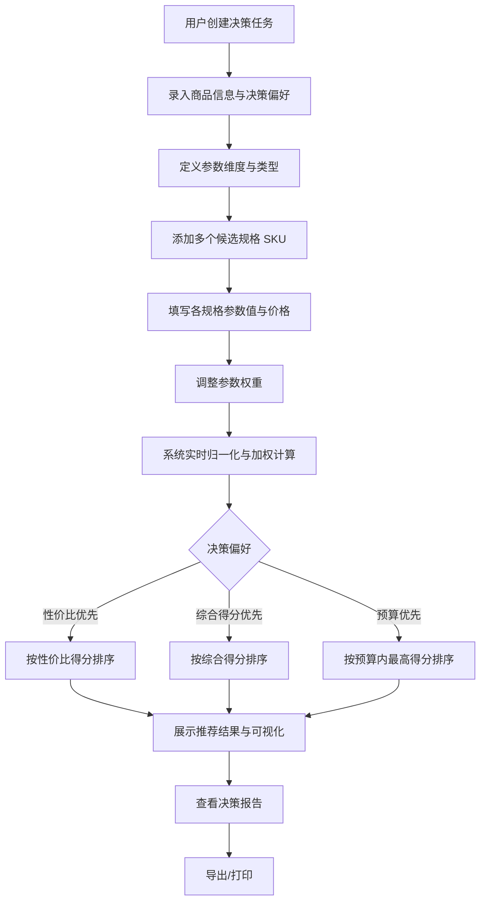

## 1. 产品概述

「SpecPick · 规格决策助手」是一款帮助用户在多规格商品购买场景下做出理性决策的本地化工具。当用户面对同一商品的多种 SKU（如手机不同存储容量、耳机不同配色套装、笔记本电脑不同处理器配置等）时，本工具通过参数录入、权重配置和综合打分算法，推荐性价比最高或最贴合个人需求的规格方案。

- **目标用户**：数码爱好者、家庭采购决策者、追求理性消费的年轻群体
- **核心价值**：把"凭感觉选规格"升级为"用数据选规格"，避免被营销话术误导，将决策过程可视化、可追溯

## 2. 核心功能

### 2.1 用户角色
本工具为单用户本地化应用，无需注册登录，所有数据存储在浏览器本地。

### 2.2 功能模块

1. **决策工作台（主页面）**：商品任务管理、规格录入、权重配置、智能推荐、对比可视化
2. **决策报告（次页面）**：完整决策报告展示、对比图表、决策依据说明、可导出/打印

### 2.3 页面详情

| 页面名称 | 模块名称 | 功能描述 |
|-----------|-------------|---------------------|
| 决策工作台 | 任务列表侧栏 | 创建/切换/重命名/删除决策任务，显示每个任务的推荐结果摘要 |
| 决策工作台 | 商品信息头 | 设置商品类别、名称、备注、决策偏好（性价比优先 / 综合得分优先 / 预算优先） |
| 决策工作台 | 参数维度管理 | 添加/编辑/删除参数维度（如内存、续航、屏幕素质），设置参数类型（数值越大越好 / 数值越小越好 / 布尔 / 文本评级） |
| 决策工作台 | 规格录入表格 | 添加多个 SKU，为每个规格填写各参数值与价格，支持快速复制 |
| 决策工作台 | 权重配置面板 | 滑块设置每个参数维度的重要性权重（0-100），实时显示权重分布饼图 |
| 决策工作台 | 推荐结果区 | 大字号展示最优规格推荐卡片，附得分、价格、关键优势说明，下方排名列表展示所有规格的综合得分与性价比 |
| 决策工作台 | 对比可视化区 | 雷达图（多维度对比）、价格-性能散点图、参数对比柱状图，可切换图表类型 |
| 决策报告 | 报告头部 | 商品名称、决策日期、最终推荐规格 |
| 决策报告 | 决策依据 | 列出推荐理由、与其他规格的关键差异、避坑提示 |
| 决策报告 | 完整对比表 | 所有规格所有参数的标准化对比表，高亮最优值 |
| 决策报告 | 图表汇总 | 复用工作台的可视化图表，附文字解读 |
| 决策报告 | 导出操作 | 打印为 PDF、复制决策摘要到剪贴板 |

## 3. 核心流程

**主流程**：用户打开工具 → 创建决策任务（如"购买笔记本"）→ 录入商品基本信息 → 添加参数维度并设置类型 → 添加多个候选规格 SKU 并填入参数值和价格 → 调整参数权重 → 系统实时计算并展示推荐结果 → 用户查看可视化对比 → 进入决策报告查看完整依据 → 导出或打印。

**算法流程**：对每个数值型参数进行归一化处理（min-max 标准化至 0-100，注意越小越好的参数取反向值）→ 加权求和得到综合得分 → 性价比得分 = 综合得分 / 价格 × 1000 → 根据用户选择的决策偏好排序推荐。

## 4. 用户界面设计

### 4.1 设计风格

**美学方向**：编辑杂志风 × 现代数据分析仪表盘的混合。理性、克制、有温度，强调"用数据做决策"的专业感，但不冷冰冰。

- **主色**：奶油纸张色背景 `#f5f1ea`，深墨绿主色 `#1a3a2e`，焦橙强调色 `#e85d2f`，暖灰中性色 `#8a8378`
- **辅助色**：成功绿 `#3d7a4a`、警示红 `#c44536`、淡金高亮 `#d4a843`
- **按钮风格**：方角偏圆（2-4px 圆角），主要按钮深墨绿底白字，次要按钮描边无填充，危险操作用焦橙
- **字体**：标题用 `Fraunces`（有特色的现代衬线字体，呈现编辑感），正文用 `IBM Plex Sans`，数字用 `IBM Plex Mono`（强调数据感）
- **字号**：主标题 48-64px，推荐结果大数字 96px，章节标题 24px，正文 14-15px
- **布局风格**：左侧固定任务导航栏（240px），主区域采用 12 列编辑式网格，大量留白，关键数据密集排布
- **图标风格**：极简线性图标（1.5px stroke），少量装饰性几何元素
- **特色元素**：纸张纹理叠加、规则线分隔、装饰性序号、大数字推荐展示

### 4.2 页面设计概览

| 页面名称 | 模块名称 | UI 元素 |
|-----------|-------------|-------------|
| 决策工作台 | 任务列表侧栏 | 暖灰背景，任务卡片含商品名+推荐摘要，激活项焦橙左竖线 |
| 决策工作台 | 商品信息头 | 大号衬线标题，类别 tag，决策偏好 segmented control，备注输入框 |
| 决策工作台 | 参数维度管理 | 卡片式参数列表，每张卡片含名称、类型选择、权重滑块、删除按钮 |
| 决策工作台 | 规格录入表格 | 编辑风表格，奇数行奶油底，首列固定规格名，末列价格加粗 |
| 决策工作台 | 权重配置面板 | 横向滑块组，右侧小型饼图实时展示权重分布 |
| 决策工作台 | 推荐结果区 | 大号 96px 推荐规格名+焦橙色，下方得分卡片矩阵，排名列表带迷你进度条 |
| 决策工作台 | 对比可视化区 | 切换 tab 选择图表类型，雷达图主色墨绿+焦橙双轴，散点图带规格标签 |
| 决策报告 | 报告头部 | 居中编辑式排版，装饰性日期戳，大号推荐规格展示 |
| 决策报告 | 决策依据 | 编号列表，每条含图标+理由+数据佐证 |
| 决策报告 | 完整对比表 | 最优值焦橙背景高亮，规格名首列冻结 |
| 决策报告 | 图表汇总 | 居中卡片，下方文字解读 |
| 决策报告 | 导出操作 | 顶部右侧固定，打印+复制按钮 |

### 4.3 响应式
- 桌面优先（1280px+ 完整三栏布局）
- 平板（768-1279px）侧栏折叠为图标，主区域单列
- 移动端（<768px）侧栏抽屉式，表格横向滚动，推荐结果区简化为大卡片堆叠，触摸优化（按钮最小 44px 触摸区）

### 4.4 3D 场景
本项目不涉及 3D 场景。
