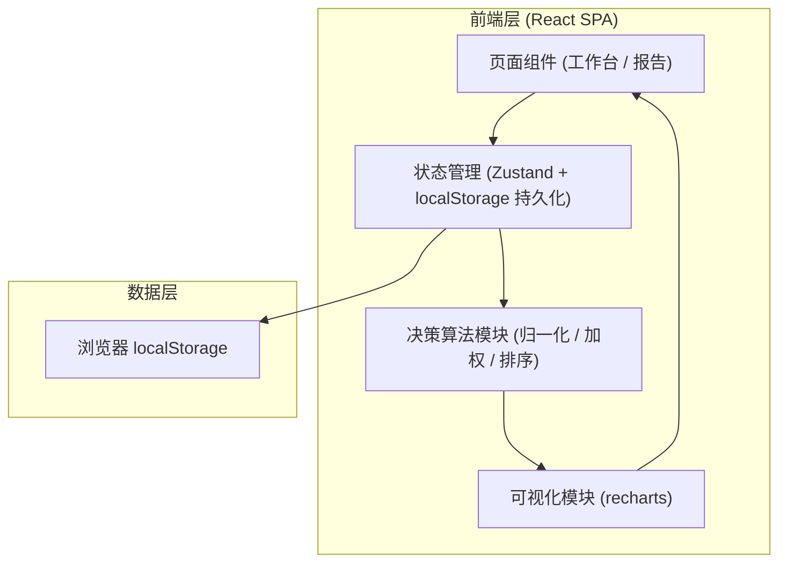
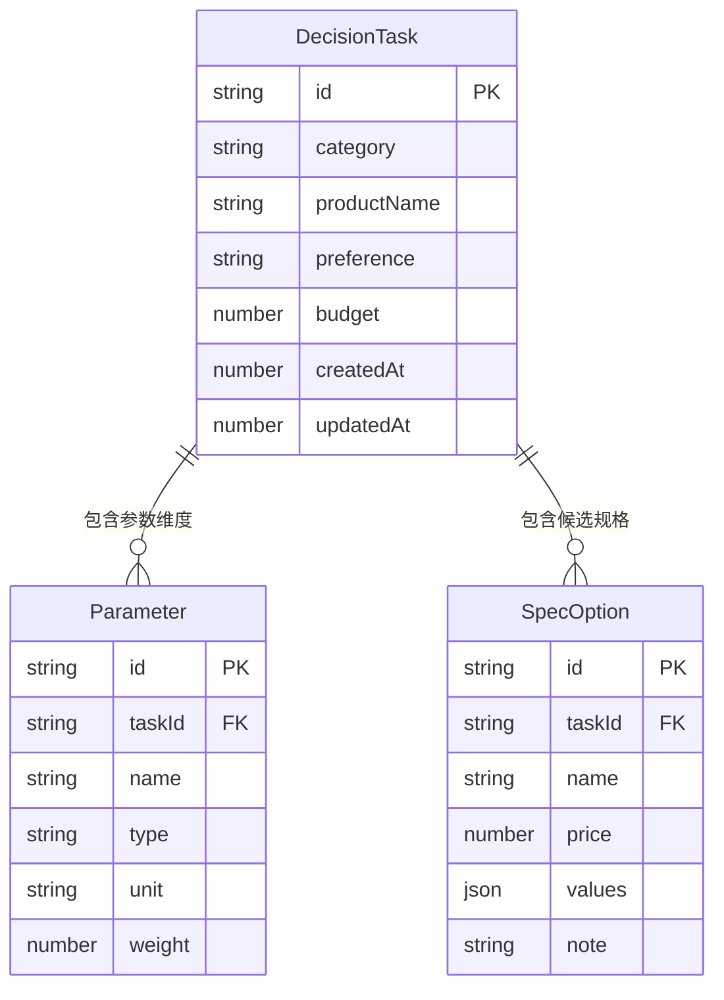

## 1. 架构设计



本应用为纯前端单页应用，无后端服务，所有数据通过 localStorage 持久化在浏览器本地。算法模块为纯函数，便于测试和复用。

## 2. 技术栈

- **前端框架**：React@18 + TypeScript@5 + Vite@5
- **初始化工具**：vite-init（react-ts 模板）
- **样式方案**：TailwindCSS@3 + CSS 变量（自定义主题色与字体）
- **状态管理**：Zustand@4（轻量，原生支持持久化中间件）
- **可视化库**：recharts@2（雷达图、散点图、柱状图、饼图）
- **动画库**：framer-motion@11（页面切换、推荐结果揭晓动画）
- **图标库**：lucide-react@0.400+（线性图标）
- **字体**：Google Fonts 加载 Fraunces / IBM Plex Sans / IBM Plex Mono
- **后端**：无
- **数据库**：无（localStorage 即数据层）

## 3. 路由定义

| 路由 | 用途 |
|-------|---------|
| `/` | 决策工作台主页面（任务列表 + 任务详情） |
| `/report/:taskId` | 决策报告页面，根据 taskId 展示对应任务的决策报告 |

使用 react-router-dom@6 管理路由。

## 4. API 定义
无后端 API。所有数据通过 Zustand store 与 localStorage 交互。

### 4.1 核心 TypeScript 类型定义

```typescript
// 参数类型枚举
type ParamType = 'higher_better' | 'lower_better' | 'boolean' | 'rating';

// 决策偏好
type DecisionPreference = 'value' | 'score' | 'budget';

// 参数维度
interface Parameter {
  id: string;
  name: string;          // 如 "续航时间"
  type: ParamType;       // 数值类型
  unit?: string;         // 单位，如 "小时"
  weight: number;        // 权重 0-100
}

// 规格 SKU
interface SpecOption {
  id: string;
  name: string;          // 如 "8GB+256GB"
  price: number;
  values: Record<string, string | number | boolean>; // parameterId -> 值
  note?: string;
}

// 决策任务
interface DecisionTask {
  id: string;
  category: string;      // 商品类别
  productName: string;
  preference: DecisionPreference;
  budget?: number;       // 预算上限（budget 模式使用）
  parameters: Parameter[];
  options: SpecOption[];
  createdAt: number;
  updatedAt: number;
}

// 计算结果
interface ScoreResult {
  optionId: string;
  totalScore: number;    // 综合得分 0-100
  valueScore: number;    // 性价比得分
  paramScores: Record<string, number>; // 各参数标准化值
  rank: number;
}
```

### 4.2 算法核心函数签名

```typescript
// 归一化单个参数
function normalizeParameter(
  values: (string | number | boolean)[],
  type: ParamType
): number[]: // 返回 0-100 标准化值数组

// 计算综合得分
function calculateScores(task: DecisionTask): ScoreResult[]

// 根据偏好排序
function rankByPreference(
  results: ScoreResult[],
  preference: DecisionPreference,
  budget?: number
): ScoreResult[]
```

## 5. 服务器架构
无后端服务。

## 6. 数据模型

### 6.1 数据模型定义



### 6.2 数据定义语言

由于使用 localStorage（JSON 存储），不涉及 SQL DDL。localStorage 键设计：

```text
# 存储所有决策任务（数组）
speckpick:tasks -> DecisionTask[]

# 存储当前激活的任务 ID
speckpick:active_task_id -> string

# 存储用户偏好设置
speckpick:settings -> { theme: 'light', lastVisit: number }
```

localStorage 写入采用防抖（300ms），避免高频更新损耗性能。数据结构变更时通过版本号字段 `speckpick:version`（当前 `1`）做迁移。
