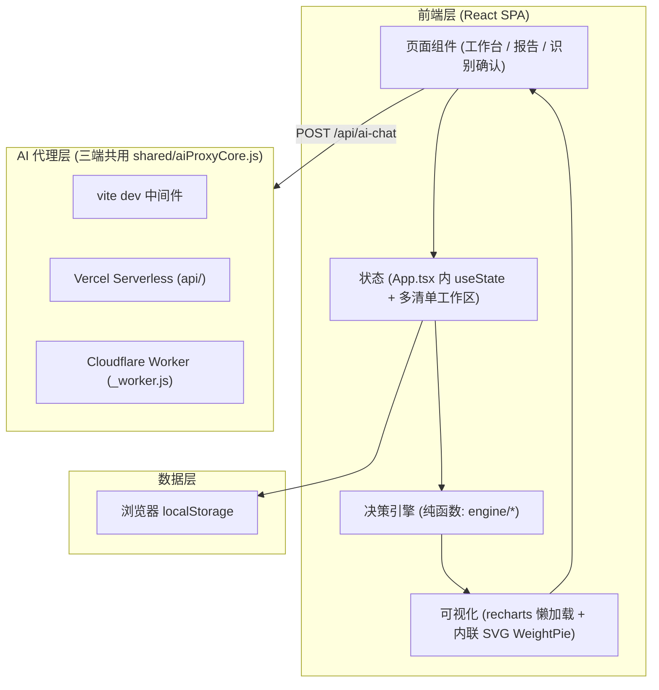
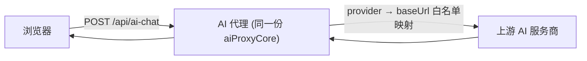
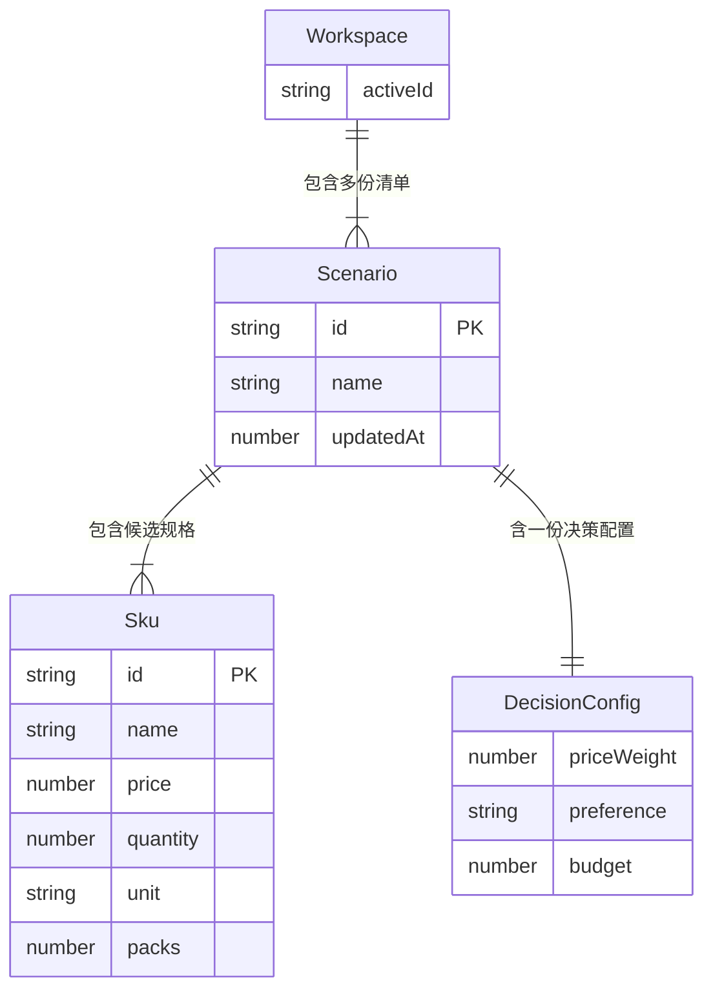

## 1. 架构设计


```mermaid
flowchart TB
    subgraph Frontend["前端层 (React SPA)"]
        UI["页面组件 (工作台 / 报告 / 识别确认)"]
        State["状态 (App.tsx 内 useState + 多清单工作区)"]
        Algo["决策引擎 (纯函数: engine/*)"]
        Viz["可视化 (recharts 懒加载 + 内联 SVG WeightPie)"]
    end

    subgraph DataLayer["数据层"]
        LS["浏览器 localStorage"]
    end

    subgraph Proxy["AI 代理层 (三端共用 shared/aiProxyCore.js)"]
        Dev["vite dev 中间件"]
        Ver["Vercel Serverless (api/)"]
        CF["Cloudflare Worker (_worker.js)"]
    end

    UI --> State
    State --> LS
    State --> Algo
    Algo --> Viz
    Viz --> UI
    UI -->|"POST /api/ai-chat"| Proxy
```

本应用为**纯前端单页应用**：业务数据不经过任何服务器，全部通过 `localStorage` 持久化在浏览器本地。决策引擎为纯函数模块，便于测试与复用。唯一的服务端代码是 AI 代理层——它只做请求转发（解决浏览器 CORS），不存储任何用户数据。

## 2. 技术栈

- **前端框架**：React@18 + TypeScript@5 + Vite@6
- **样式方案**：TailwindCSS@3 + CSS 变量（`src/index.css` 中用 `:root` / `html.dark` 定义 `--c-panel` / `--c-edge` / `--c-brand-soft` / `--c-brand-deep`，Tailwind 侧以 `rgb(var(--x) / <alpha-value>)` 注册，切换 `html.dark` 即整站换肤）
- **状态管理**：**无第三方状态库**。全局状态由 [App.tsx](file:///workspace/src/App.tsx) 内的 `useState` 持有（`workspace` / `theme` / `aiConfig` / `page` 等），启动时经 [store.ts](file:///workspace/src/lib/store.ts) 从 `localStorage` 载入
- **路由**：**无路由库**。仅两个页面（工作台 / 报告），用 `App.tsx` 的 `page` state 切换；报告页用 `React.lazy` 按需加载。只读分享走 **URL hash**（`buildShareUrl` / `readShareToken` / `decodeShare`），无服务端路由
- **可视化库**：recharts@2（雷达图、散点图、柱状图）+ 内联 SVG 手绘的 `WeightPie`（首屏权重环形图，刻意不引 recharts）
- **动画库**：framer-motion@11（页面切换、推荐结果揭晓动画）
- **图标库**：lucide-react（线性图标）
- **字体**：自托管 `Space Grotesk` 可变字体（`public/fonts/*.woff2`，latin 子集，不请求 Google Fonts）+ `JetBrains Mono`（数字），中文回退系统字体
- **后端**：无（AI 代理为纯转发，见第 5 节）
- **数据库**：无（`localStorage` 即数据层）

## 3. 页面与路由

无客户端路由库，页面由 `App.tsx` 的 `page` state 决定：

| 页面 | 切换方式 | 说明 |
|-------|---------|------|
| 工作台 | `page === 'workbench'` | 规格录入 / 多清单 / 价格历史 / 维度权重 / 识别与粘贴入口 |
| 报告 | `page === 'report'`（`React.lazy` 按需加载） | 排名 / 主视觉 + 避坑标注 / 升档卡 / 导出分享下拉 |
| 只读分享视图 | URL hash 命中 `decodeShare` | 额外叠加一份只读数据，**不写入**本地清单 |

分享链接把整份数据（SKU + 配置）压缩进 URL hash（deflate-raw + base64url，见 [share.ts](file:///workspace/src/lib/share.ts)），打开即渲染，服务端零参与。

## 4. API 定义

对外只有一个 HTTP 端点族，全部用于 AI 转发，**不触碰业务数据**：

| 端点 | 方法 | 用途 |
|-------|------|------|
| `/api/ai-chat` | POST | OpenAI 兼容对话 / 视觉识别转发 |
| `/api/ai-models` | POST | 拉取服务商可用模型列表 |
| `/api/recognize` | POST | 可选的服务端视觉识别端点（Vercel Edge，四服务商） |

三端（vite dev / Vercel / Cloudflare）共用同一份核心 [shared/aiProxyCore.js](file:///workspace/shared/aiProxyCore.js)：统一做主机白名单 / 私网段拒绝、请求体体积上限、超时（504）、`provider` 枚举映射，并**禁止记录请求体**（含密钥与图片 base64）。

### 4.1 核心 TypeScript 类型定义

领域模型集中在 [src/lib/types.ts](file:///workspace/src/lib/types.ts)（以下是节选）：

```typescript
// 参数维度类型（注意：连字符命名，非下划线）
type ParamType = 'higher-better' | 'lower-better' | 'boolean' | 'text'

// 参数维度定义（全局，跨所有 SKU 共享）
interface ParamDim {
  id: string
  label: string          // 维度名，如 "电池容量"
  type: ParamType
  weight: number         // 0-100
  unit?: string          // 单位提示，如 "mAh"
  levels?: string[]      // text 类型专用：评级序列（从优到劣）
}

// 单个规格 SKU
interface Sku {
  id: string
  name: string
  price: number          // 总价（元）
  quantity: number       // 单件含量数值（如 16）
  unit: string           // 单件含量单位（如 g / ml / 个）
  packs: number          // 件数 / 袋数
  packUnit?: string      // 件数量词（袋/瓶/罐…）
  params?: Record<string, number | string | undefined>  // key = ParamDim.id
  priceHistory?: { t: number; price: number }[]
}

// 计算后的 SKU（引擎输出）
interface ComputedSku extends Sku {
  totalQuantity: number  // 总量 = quantity * packs
  unitPrice: number      // 每单位价格 = price / totalQuantity
  packPrice: number      // 每包价格 = price / packs
  score: number          // 综合得分 0-100
  rank: number
  isBest: boolean
  dimScores?: Record<string, number>
}

// 决策偏好
type Preference = 'value' | 'score' | 'budget'

// 决策配置
interface DecisionConfig {
  dims: ParamDim[]       // 当前清单的参数维度列表
  priceWeight: number    // 价格维度自身权重（默认 50）
  preference: Preference
  budget?: number        // preference = budget 时生效
  category?: string      // 由识别自动填入，用于自适应列名
  flavorLabel?: string   // AI 建议的"口味列"列名
}

// 决策结果
interface DecisionResult {
  items: ComputedSku[]
  best: ComputedSku | null
  baseline: ComputedSku | null
  margins: MarginInsight[]
  warnings: string[]
  warningPairs: WarningPair[]
  warningNotes: string[]
  reasons: string[]
  clusters: SkuCluster[]
  hasVariants: boolean
  budgetExcludedItems: ComputedSku[]
}
```

### 4.2 引擎核心函数签名

决策引擎已从单文件 `engine.ts` 按职责拆分为 [src/lib/engine/](file:///workspace/src/lib/engine) 下的多个纯函数模块：

```typescript
// 主入口：给定 SKU 列表与配置，产出完整决策结果
function decide(skus: Sku[], config: DecisionConfig): DecisionResult

// 单位归一化（公制 / 市制 / 英制大表）
function normalizeUnit(...): ...

// 决策简化：按定价因子聚合 SKU，并对簇排序（性价比 / 得分 / 预算过滤）
function buildClusters(...): SkuCluster[]

// 价格历史：记录 / 清洗 / 涨跌走势
function recordPrice(...): ...
```

## 5. 服务器架构

**无业务后端**。服务器侧仅有 AI 代理，用于绕过浏览器 CORS 并隐藏/透传用户自带的 API Key：


```mermaid
flowchart LR
    B["浏览器"] -->|"POST /api/ai-chat"| A["AI 代理 (同一份 aiProxyCore)"]
    A -->|"provider → baseUrl 白名单映射"| U["上游 AI 服务商"]
    U --> A --> B
```

- **vite dev**：`configureServer` / `configurePreviewServer` 挂载中间件（[vite.config.ts](file:///workspace/vite.config.ts)）
- **Vercel**：`api/ai-chat.js` / `api/ai-models.js` / `api/recognize.ts`
- **Cloudflare**：`_worker.js` 接管 `/api/*` + 静态资源 SPA 回退

AI 密钥只存在浏览器本地（`localStorage`），请求时随请求头/体传给代理，代理不落盘。

## 6. 数据模型

### 6.1 工作区（多清单）


```mermaid
erDiagram
    Workspace ||--|{ Scenario : "包含多份清单"
    Scenario ||--|{ Sku : "包含候选规格"
    Scenario ||--|| DecisionConfig : "含一份决策配置"
    Workspace {
        string activeId
    }
    Scenario {
        string id PK
        string name
        number updatedAt
    }
    Sku {
        string id PK
        string name
        number price
        number quantity
        string unit
        number packs
    }
    DecisionConfig {
        number priceWeight
        string preference
        number budget
    }
```

`Workspace` = `{ scenarios: Scenario[], activeId: string }`，定义见 [store.ts](file:///workspace/src/lib/store.ts)。每份 `Scenario` 自带 SKU 列表与决策配置，互不干扰。

### 6.2 存储定义

由于使用 `localStorage`（JSON 存储），不涉及 SQL DDL。实际使用的键：

```text
# 多清单工作区（当前主数据）
spec-decision:scenarios      -> Workspace

# 旧版单份数据（v1，经 migrateToWorkspace 迁移进 scenarios 后不再更新）
spec-decision:skus           -> Sku[]
spec-decision:config         -> DecisionConfig

# 主题
spec-decision:theme          -> 'light' | 'dark'

# 一次性迁移标记
spec-decision:migrated-v2    -> string

# 脏数据留档：解析失败 / 结构不可用时，先备份原文再降级，绝不静默覆盖
spec-decision:corrupt-backup -> string
```

写入健康度：所有写入经 `store.ts` 的 `write` / `writeJson` 包装，失败（配额超限 / 存储被禁用）不会静默吞掉，而是记入 `PersistIssue` 并通过 `onPersistIssue` 通知 UI 红条提示，引导用户导出备份。删除清单 / 覆盖导入走 10 秒 TTL 的撤销槽（[undo.ts](file:///workspace/src/lib/undo.ts)）。
