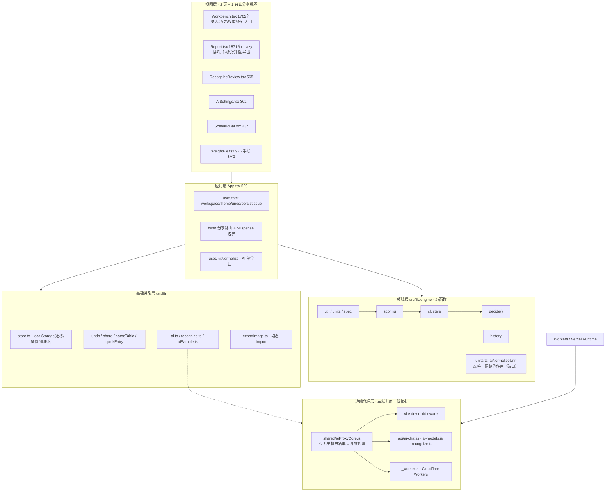

# SpecPick · 全维度代码审计与迭代规划报告

> 审计角色：技术负责人视角的全仓扫描
> 审计日期：2026-09-16
> 审计对象：`spec-decision`（SpecPick 规格决策台）v1.1.0
> 代码基线：工作区 HEAD（`git log` 共 1 个提交，无历史可对照）
> 审计方式：**只读**。所有耗时/体积/告警数据均为本机实测，非估算；代码结论均附 `文件:行号` 与代码片段

---

## 0. 审计方法与证据来源

### 0.1 执行的验证动作

| 动作 | 命令 | 退出码 | 实测结果 |
|---|---|---|---|
| 依赖安装 | `npm ci` | 0 | 413 packages，5.7s |
| 单元测试 | `npm test` | 0 | **11 个测试文件 / 163 个用例全通过**（5.61s） |
| 生产构建 | `npm run build` | 0 | `tsc -b` + `vite build`；2578 modules；vite 4.67s；无警告 |
| 静态检查 | `npm run lint` | 0 | 0 error / 23 warning（全部为 `no-explicit-any`） |
| 端到端 | `npm run e2e` | **1** | 构建成功，`chromium.launch()` 失败：浏览器未安装 |
| 依赖安全 | `npm audit` | 1 | 9 条（1 critical / 3 high / 5 moderate），**全部落在 dev/build 链** |
| 生产依赖安全 | `npm audit --omit=dev` | 0 | **0 条** |
| 依赖新鲜度 | `npm outdated` | — | 21 项落后，其中 9 个 major |

### 0.2 覆盖范围

已审：`src/`（39 个源文件 / 8991 行）、`api/`（3 个边缘函数）、`shared/aiProxyCore.js`、`_worker.js`、`public/sw.js`、`e2e/`、全部构建与部署配置（`vite.config.ts` / `tsconfig.json` / `eslint.config.js` / `vercel.json` / `wrangler.toml` / `.env.example` / `index.html`）、测试与文档资产。

基线资产规模（`wc -l` 实测）：源码 12033 行（含测试与文档），其中 `Report.tsx` 1870 行、`Workbench.tsx` 1762 行合计占**UI 层 62%**。

### 0.3 关于"健康"的既有事实（先说好的）

审计不是找茬，以下结论同样有据，且决定了后续方案的取舍边界：

- 构建**位级可复现**：连续两次 `vite build` 产物哈希一致（`charts-KaXR5Kqd.js` 等），无时间戳污染。
- 首屏体积控制得当：首屏 543,567 B（原始）/ 约 171 KB（gzip）；`recharts`（334 KB）与 `html-to-image` 真正惰性化，由 [App.tsx:25](file:///workspace/src/App.tsx#L25) 的 `lazy()` 与 [exportImage.ts:69](file:///workspace/src/lib/exportImage.ts#L69) 的动态 `import()` 保证。
- [vite.config.ts:86-94](file:///workspace/vite.config.ts#L86-L94) 的 `manualChunks` 用**函数按真实 module id 分组**，规避了"数组写法匹配不到 `react/jsx-runtime` 导致 0 字节 vendor chunk"的经典陷阱。
- 引擎已按职责从单文件拆成 `src/lib/engine/`，**依赖方向正确、无循环依赖**；`types.ts` 作为纯类型中台被全层引用。
- 生产依赖 `npm audit --omit=dev` 干净；无密钥入库；全仓**无 `dangerouslySetInnerHTML` / `innerHTML` / `eval`**，表格粘贴走 `DOMParser` + `textContent`（[parseTable.ts:61-68](file:///workspace/src/lib/parseTable.ts#L61-L68)），无 DOM XSS 面。
- 存在真实的质量取舍：`WeightPie` 手绘 SVG 刻意不引 recharts（[WeightPie.tsx:18-23](file:///workspace/src/components/WeightPie.tsx#L18-L23)）。
- 工程判断力在若干细节上高于平均：`share.ts` 用 `CHUNK = 0x8000` 分块规避展开限制（[share.ts:23-30](file:///workspace/src/lib/share.ts#L23-L30)）；`store.ts:11-13` 明文确立"持久化失败必须让用户知道"的原则；`history.ts:54-62` 的"返回原引用表示无变更"契约被文档化。

---

# 第一部分 · 代码现状诊断与优化方案

## 1. 全局画像

### 1.1 架构图（实际形态，非文档声称形态）



### 1.2 技术栈健康度评分

评分标准：单维度 0-100，权重按"对当前产品形态的风险贡献度"分配。

| 维度 | 权重 | 得分 | 关键依据 |
|---|---:|---:|---|
| 功能正确性与领域建模 | 20% | **85** | 163/163 单测通过；引擎拆分后分层正确、无循环依赖；`decide()` 单一入口收敛良好 |
| 架构分层与耦合 | 15% | **80** | 分层方向正确；扣分项为 engine 反向依赖 AI IO、store 经 barrel 拉入 AI 依赖图 |
| 代码质量与可维护性 | 15% | **62** | 两个 >1700 行巨型组件承载全部交互；`FLAVOR_COLORS` 三处重复；缺 memo 造成全行重渲染 |
| 性能与资源 | 10% | **72** | 分块策略优秀（首屏 171 KB gzip）；扣分项为 5 处未清理定时器、监听器随 `[skus]` 重挂、`useChartTheme` 破坏 recharts memo |
| 安全与合规 | 15% | **42** | **开放代理 + SSRF**、`/api/recognize` 无鉴权无限流直烧付费密钥、CORS `*`、密钥中转与隐私文案矛盾 |
| 测试与质量门禁 | 15% | **45** | 单测质量高但覆盖不均（`share.ts`/`parseTable.ts`/`clusters.ts` 零覆盖、组件层零测试）；**无覆盖率工程** |
| 工程化 / CI-CD / 可观测性 | 10% | **28** | **零 CI**；e2e 在干净环境 100% 失败；595 行 JS（含 SW 与代理核心）不受 lint 约束；无错误上报/日志/指标 |
| **加权总分** | 100% | **61 / 100 · B-** | 功能可用、工程骨架在，但**存在可被外部直接利用的安全缺口**与**完全缺失的质量门禁** |

评级说明：
- **B-**（60-69）：可以作为在线产品运行，但依赖"没人攻击 + 交付者手工自律"两个隐含前提。
- 若只做本报告"高收益低成本"清单（第 3 节路线 A），预计总分可升至 **78 / B+**，且不需要改动任何领域算法。

### 1.3 核心债务清单（按风险排序，含代码依据）

| # | 债务 | 等级 | 代码依据 | 后果 |
|---|---|---|---|---|
| D1 | **`/api/ai-*` 是任意主机转发器（SSRF + 开放代理）** | 🔴 P0 | [aiProxyCore.js:15-17](file:///workspace/shared/aiProxyCore.js#L15-L17)、[30-32](file:///workspace/shared/aiProxyCore.js#L30-L32)、[66-67](file:///workspace/shared/aiProxyCore.js#L66-L67) | 匿名请求可让部署去访问 `169.254.169.254` / `127.0.0.1` / 内网段并**读取回显**；同时可白嫖出口 IP 做代理 |
| D2 | **`/api/recognize` 无鉴权、无限流、无体积校验，直烧服务端付费密钥** | 🔴 P0 | [recognize.ts:26-44](file:///workspace/api/recognize.ts#L26-L44)、[55](file:///workspace/api/recognize.ts#L55) | `curl` 即可无限调用 `qwen-vl-max`，**费用记在部署者账上**；超大 base64 造成函数内存/耗时打满 |
| D3 | **多标签页并发全量覆盖写，静默丢数据** | 🔴 P0 | 写入 [store.ts:293-297](file:///workspace/src/lib/store.ts#L293-L297) + [App.tsx:69](file:///workspace/src/App.tsx#L69)；全仓**无** `storage` 事件 / `BroadcastChannel` / `navigator.locks` | 两个标签页各自持内存副本，后写者把整份工作区覆盖，先写者的新增清单/改价被无声抹掉 |
| D4 | **零 CI：test / lint / typecheck / e2e 在合入前无任何自动化保障** | 🔴 P0 | `package.json:6-13` 有脚本但**仓库无 `.github/` / `.gitlab-ci.yml` / `Jenkinsfile` 等任何 CI 配置**（已穷举探测） | 回归防线完全依赖人；`package-lock.json` 一致性无人守 |
| D5 | **e2e 在干净环境必然失败** | 🟠 P1 | [package.json:12](file:///workspace/package.json#L12) `"e2e": "npm run build && node e2e/smoke.mjs"`；失败点 [e2e/smoke.mjs:222](file:///workspace/e2e/smoke.mjs#L222) | 实测报 `Executable doesn't exist at .../chrome-headless-shell`。**"组件零单测 + e2e 跑不动"= 双层防线同时失效** |
| D6 | **`Report.tsx` 1871 行 / `Workbench.tsx` 1762 行巨型组件** | 🟠 P1 | [Report.tsx:734-1679](file:///workspace/src/components/Report.tsx#L734-L1679)（主组件约 945 行）、[Workbench.tsx:274-1337](file:///workspace/src/components/Workbench.tsx#L274-L1337)（约 1063 行） | 内联 IIFE 计算与多职责耦合，回归风险高、不可单测 |
| D7 | **engine 层引入网络副作用（纯度破口）** | 🟠 P1 | [units.ts:2](file:///workspace/src/lib/engine/units.ts#L2) `import { chat } from '../ai'` + [units.ts:77-97](file:///workspace/src/lib/engine/units.ts#L77-L97)，并经 [engine/index.ts](file:///workspace/src/lib/engine/index.ts) barrel 导出 | 任何 `from './engine'` 的调用方都被拉入 `ai.ts` → `localStorage` 依赖；`units.test.ts` 只能绕开不测该函数 |
| D8 | **`Math.max(...arr)` 展开处理外部任意行数输入 → 栈溢出崩溃** | 🟠 P1 | [parseTable.ts:108](file:///workspace/src/lib/parseTable.ts#L108)（输入为**用户粘贴的任意表格**）、[scoring.ts:89-90/112/322](file:///workspace/src/lib/engine/scoring.ts#L89-L90)、[clusters.ts:34-36](file:///workspace/src/lib/engine/clusters.ts#L34-L36) | 超过 V8 实参上限（约 6.5 万）抛 `RangeError`，发生在渲染期 → 整页崩溃 |
| D9 | **`loadWorkspace` 读取即写盘；损坏数据被空清单不可逆覆盖** | 🟠 P1 | [store.ts:276-291](file:///workspace/src/lib/store.ts#L276-L291) → [223-236](file:///workspace/src/lib/store.ts#L223-L236)；`catch` 分支把**任何** JSON 异常当"需迁移" | 覆盖前无备份、无日志，原始数据可能彻底不可恢复 |
| D10 | **关键模块零测试：`share.ts` / `parseTable.ts` / `clusters.ts` / `aiSample.ts`** | 🟠 P1 | 11 个测试文件分布见 1.4；`parseTable.ts` 是**外部输入唯一入口**，`share.ts` 是**数据外发链路** | 编解码错一位即产生"用户看到的清单与发送方不一致"的静默错误 |
| D11 | **CORS `Access-Control-Allow-Origin: *` 叠加无鉴权代理** | 🟠 P1 | [_worker.js:14-18](file:///workspace/_worker.js#L14-L18) | 任意站点可在受害者浏览器里借用你的域名与出口配额 |
| D12 | **密钥经自建服务端中转，与产品隐私文案矛盾；且 localStorage 明文** | 🟠 P1 | [ai.ts:2](file:///workspace/src/lib/ai.ts#L2) 注释"密钥不离开浏览器" vs [ai.ts:85-97](file:///workspace/src/lib/ai.ts#L85-L97) 把 `apiKey` POST 到 `/api/ai-chat`；[AiSettings.tsx:276-279](file:///workspace/src/components/AiSettings.tsx#L276-L279) 宣称"不经过任何第三方服务器" | **数据合规风险**：用户（可能是企业采购的高权限 Key）会形成错误安全预期；部署方/A PM 可见全量 Key |
| D13 | **595 行 JS 完全不受 lint 约束** | 🟠 P1 | [eslint.config.js:11](file:///workspace/eslint.config.js#L11) `files: ['**/*.{ts,tsx}']` 同时收窄了 `js.configs.recommended`；实测 `--print-config` 生效规则数：`App.tsx` 91 条、`_worker.js` 与 `api/ai-chat.js` **0 条** | 最贴近安全边界的代码（Worker / 代理核心 / SW）"lint 0 errors"是**假绿灯** |
| D14 | 无请求体大小上限；上游 `fetch` 无超时 | 🟡 P2 | [vite.config.ts:40-44](file:///workspace/vite.config.ts#L40-L44)、[aiProxyCore.js:66](file:///workspace/shared/aiProxyCore.js#L66) | 数十 MB base64 造成内存放大；上游挂起即占满函数 |
| D15 | 上游错误正文与异常 `message` 原样透传 | 🟡 P2 | [aiProxyCore.js:68-70](file:///workspace/shared/aiProxyCore.js#L68-L70)、[vite.config.ts:53](file:///workspace/vite.config.ts#L53) | 回显内部主机名/DNS/TLS 细节，配合 D1 成为内网探测的"回显通道" |
| D16 | 文档与实现**系统性分叉**（三份文档互相矛盾） | 🟡 P2 | [TechnicalArchitecture.md:27-45](file:///workspace/.trae/documents/TechnicalArchitecture.md#L27-L45) 称 `Zustand@4` + `react-router-dom@6` + `/report/:taskId`，而 `package.json` 无这两个依赖、代码是 hash 分享视图；同文件 `speckpick:tasks` 键名与实际的 `spec-decision:skus/scenarios` 完全不同 | 文档无法用于运维排查与新人上手，反而误导 |
| D17 | `ACTIVE_KEY` 只写不读的僵尸键 | 🟡 P2 | 定义 [store.ts:9](file:///workspace/src/lib/store.ts#L9)、写入 [store.ts:296](file:///workspace/src/lib/store.ts#L296)；全仓 Grep 仅此 2 处 | `activeId` 已内嵌于 `SCENARIOS_KEY` JSON（[store.ts:280/284](file:///workspace/src/lib/store.ts#L280-L284)），此键是冗余副本且双键写非原子，会误导后来者 |
| D18 | 持久化失败告警只活内存，刷新即"假装恢复" | 🟡 P2 | `persistIssues` 为模块级内存变量 [store.ts:25-29](file:///workspace/src/lib/store.ts#L25-L29)，消费点 [App.tsx:57](file:///workspace/src/App.tsx#L57) | 配额满后刷新页面提示消失，但存储问题未解除 → 用户误判已恢复并在下次改动再丢数据 |
| D19 | 可观测性为零 | 🟡 P2 | 全仓无错误上报/SDK；仅 4 处 `console.error`（如 [vite.config.ts:50](file:///workspace/vite.config.ts#L50)） | 线上问题只能靠用户口述，无数据可查 |
| D20 | `chunkSizeWarningLimit: 900` 掩盖体积回归 | 🟡 P2 | [vite.config.ts:80](file:///workspace/vite.config.ts#L80) | 实测最大 chunk 334 KB 本就不会触发默认 500 KB 告警；调到 900 后 `charts` 可再涨 2.7 倍仍静默 |
| D21 | 依赖 9 条安全告警 + 21 项落后 | 🟡 P2 | `npm audit`：`vitest@2.1.9` critical（UI server 任意文件读取）、`vite@5.4.21`（vitest 嵌套副本）high、`browserslist`/`nanoid` high、`postcss@8.5.20`/`esbuild` moderate | 全在 dev/build 链，生产 `--omit=dev` 为 0；但 `vite`/`esbuild` 告警直指 **dev server**，`--host` 暴露即被读源码 |
| D22 | 版本约束为零 + 无格式化/提交门禁 | 🟡 P2 | `package.json` 无 `engines`/`packageManager`，仓库无 `.nvmrc`/`.tool-versions`/`.prettierrc`/`.editorconfig`/`husky` | 实测环境已是 Node v24.1.0 而无人声明支持范围；`*.mjs` 全局忽略然后白名单回补 ([.gitignore:13-15](file:///workspace/.gitignore#L13-L15)) 会静默吞掉新增工具脚本 |

### 1.4 测试资产盘点（实测）

11 个测试文件全部位于 `src/lib/**` 与 `shared/`：

```
engine/{util,units,spec,scoring,history}.test.ts   lib/{store,quickEntry,recognize,undo,exportImage}.test.ts
shared/aiProxyCore.test.js
```

| 模块 | 覆盖 | 备注 |
|---|---|---|
| `engine/util · spec · scoring · history` | ✅ | `scoring` 30 例，最充分 |
| `engine/units` | ⚠️ 仅同步函数 | [units.test.ts:2](file:///workspace/src/lib/engine/units.test.ts#L2) 只 import `normalizeUnit/isKnownUnit/unitMixWarning`，**刻意绕开 `aiNormalizeUnit`** |
| `engine/clusters · decide` | ❌ / ⚠️ 间接 | `rankByPreference` 仅被 `scoring.test.ts` 间接覆盖；`clusterItems` 的分簇指纹无直接断言 |
| `store` | ⚠️ | 迁移路径（`migrateV1ToV2`/`migrateToWorkspace`）、`classifyStorageError`、双键写语义均未覆盖 |
| `share · parseTable · aiSample · ai · useUnitNormalize · useChartTheme` | ❌ | 6 个纯逻辑/Hook 模块零覆盖 |
| `components/**` + `App.tsx` | ❌ | **UI 行为零测试**（7 个文件） |

覆盖率工程缺失：无 `@vitest/coverage-v8`、无 `coverage` 配置、无 `npm run coverage`。源码 8991 行 vs 测试 1442 行 ≈ **16% 行数比**；23 个源文件无同名测试。

---

## 2. 分层优化清单

### 2.1 代码质量层

| # | 问题 | 位置 | 具体方案 |
|---|---|---|---|
| Q1 | 主组件超长（Report 945 行 / Workbench 1063 行） | [Report.tsx:734-1679](file:///workspace/src/components/Report.tsx#L734-L1679)、[Workbench.tsx:274-1337](file:///workspace/src/components/Workbench.tsx#L274-L1337) | 按职责切子组件：`ReportToolbar` / `RankTable` / `ShareMenu` / `ClusterView`；`Workbench` 抽 `ScanDropZone` / `DesktopTable` / `MobileCardList`。主组件只做数据编排 |
| Q2 | `FLAVOR_COLORS` 在 3 处、`GROUP_BAR_COLORS` 在 2 处各自重写 | [Report.tsx:218](file:///workspace/src/components/Report.tsx#L218)、[Workbench.tsx:257](file:///workspace/src/components/Workbench.tsx#L257)/[269](file:///workspace/src/components/Workbench.tsx#L269)、[RecognizeReview.tsx:35](file:///workspace/src/components/RecognizeReview.tsx#L35)/[47](file:///workspace/src/components/RecognizeReview.tsx#L47) | 收敛到 `src/lib/palette.ts`，导出色板 + `buildFlavorColorMap(skus)` / `buildDimColorMaps(skus, dims)` |
| Q3 | "同序分配颜色"循环复制三份，易漂移 | [Workbench.tsx:621-642](file:///workspace/src/components/Workbench.tsx#L621-L642)、[RecognizeReview.tsx:139-163](file:///workspace/src/components/RecognizeReview.tsx#L139-L163)、[Report.tsx:861-868](file:///workspace/src/components/Report.tsx#L861-L868) | 同上，一处实现三处调用；否则同一口味在三个页面会显示不同颜色（用户会当 bug 报） |
| Q4 | JSX 内 IIFE 做重计算 | [Report.tsx:871](file:///workspace/src/components/Report.tsx#L871)（`groupOptions`）、[928](file:///workspace/src/components/Report.tsx#L928)（`specRows`）、[959](file:///workspace/src/components/Report.tsx#L959)（`oneLiner`） | 改为 `useMemo`，或外移到 `src/lib/reportModel.ts` 纯函数 |
| Q5 | 剪贴板 + 2s 复位逻辑重复三次且时长不一致（2000/2500） | [Report.tsx:778](file:///workspace/src/components/Report.tsx#L778)、[799](file:///workspace/src/components/Report.tsx#L799)、[810](file:///workspace/src/components/Report.tsx#L810) | 抽 `useCopyFeedback(ms)` Hook，内部 `useRef` 持 timer，设置新 timer 前先 `clearTimeout` |
| Q6 | `useSkuRow` 无任何 Hook 却以 `use` 命名 | [Workbench.tsx:90](file:///workspace/src/components/Workbench.tsx#L90) | 改名 `deriveSkuRow`；否则一旦有人在条件分支调用，`rules-of-hooks` 会误报 |
| Q7 | 命名不一致：`up` / `packPrice` / `perUnit` / `unitPrice` 混用同一概念 | [Workbench.tsx:92](file:///workspace/src/components/Workbench.tsx#L92) | 统一 `perUnitPrice`，全项目一个概念一个名字 |
| Q8 | `shortName` 存在不可达三元分支（死分支） | [scoring.ts:147-153](file:///workspace/src/lib/engine/scoring.ts#L147-L153) | 由 `:149` 取反可知进入 `:150` 时 `spec` 必为空或 >20；删掉 `: spec` 分支，直接 `return \`${s.quantity}${s.unit}×${s.packs}件\`` |
| Q9 | 4 处 `eslint-disable exhaustive-deps` 未说明"为何安全" | [Workbench.tsx:614](file:///workspace/src/components/Workbench.tsx#L614)、[Report.tsx:61](file:///workspace/src/components/Report.tsx#L61)、[AiSettings.tsx:40](file:///workspace/src/components/AiSettings.tsx#L40)、[useUnitNormalize.ts:45](file:///workspace/src/lib/useUnitNormalize.ts#L45) | 每条上方补一句原因；能改 ref 的（见 P3）优先改 ref 而非禁用规则 |
| Q10 | 单位词表双份维护（语义差异合理但无交叉引用） | [parseTable.ts:27-32](file:///workspace/src/lib/parseTable.ts#L27-L32) 的 `KNOWN_UNITS` vs [units.ts:5-49](file:///workspace/src/lib/engine/units.ts#L5-L49) 的 `UNIT_TO_BASE` | 抽 `engine/unitVocabulary.ts`：导出 `CONTAINER_UNITS`（容器词，`UNIT_TO_BASE` 刻意排除）与派生的 `CONVERTIBLE_UNITS`，`KNOWN_UNITS` 由两者合成供 `parseTable` 复用；暂不重构则至少两处互指注释 |
| Q11 | 可测试性障碍：关键纯函数未 export | [Report.tsx:162](file:///workspace/src/components/Report.tsx#L162)（`buildSummaryText`）、[233](file:///workspace/src/components/Report.tsx#L233)、[280](file:///workspace/src/components/Report.tsx#L280)、[291](file:///workspace/src/components/Report.tsx#L291)；[Workbench.tsx:90](file:///workspace/src/components/Workbench.tsx#L90) | 迁出到 `lib/reportText.ts` / `lib/workbenchModel.ts` 并 export，配 Vitest 断言（`buildSummaryText` 约 70 行字符串分支，最适合快照测试） |
| Q12 | 硬编码时长散落（2000/2500/1400ms） | [Report.tsx:778/799/810/1038/1048](file:///workspace/src/components/Report.tsx#L778) | 提为模块常量 `COPY_RESET_MS` / `SHARE_RESET_MS` / `MENU_CLOSE_DELAY_MS`，由 Hook 参数化以便测试注入 |

**代码质量层正面样本（改造时参照）**：`Workbench.tsx` 的扫描计时器在 `finally` 与 `cancelScan` 双重 `clearInterval`（[Workbench.tsx:471-493](file:///workspace/src/components/Workbench.tsx#L471-L493)）；`App.tsx` 撤销过期计时器 cleanup 完整（[App.tsx:101-105](file:///workspace/src/App.tsx#L101-L105)）；`MainVisual` 的 `ResizeObserver` 有 `disconnect()`（[Report.tsx:473-480](file:///workspace/src/components/Report.tsx#L473-L480)）。

### 2.2 性能层

| # | 问题 | 位置 | 实测/机理 | 方案 |
|---|---|---|---|---|
| P1 | 5 处 `setTimeout` 未保存 id、未清理 | [Report.tsx:778](file:///workspace/src/components/Report.tsx#L778)、[799](file:///workspace/src/components/Report.tsx#L799)、[810](file:///workspace/src/components/Report.tsx#L810)、[1038](file:///workspace/src/components/Report.tsx#L1038)、[1048](file:///workspace/src/components/Report.tsx#L1048) | 卸载后回调仍 `setState`（泄漏 + 告警）；连续复制叠加多个计时器互相打断 | `useRef` 存 id + `useEffect(() => () => clearTimeout(t), [])`；或统一走 Q5 的 Hook |
| P2 | window 5 个监听器随 `[skus]` 卸载重挂 | [Workbench.tsx:548-615](file:///workspace/src/components/Workbench.tsx#L548-L615)（`eslint-disable` 在 614） | **每敲一个字符重挂 5 个全局监听器**；间隙内拖拽/粘贴事件会丢 | 用 `skusRef.current` 读取最新值，依赖改 `[]`，监听器只注册一次 |
| P3 | `useChartTheme()` 每次渲染返回新对象 | [useChartTheme.ts:37-69](file:///workspace/src/lib/useChartTheme.ts#L37-L69) | 该对象作为 prop 传给 `MainVisual`（[Report.tsx:466](file:///workspace/src/components/Report.tsx#L466)）并派生 `tooltipProps`（[Report.tsx:482](file:///workspace/src/components/Report.tsx#L482)）→ 父组件任何 state 翻转（`shareMenuOpen`/`copied`）都让 recharts 判为配置变化而重渲染 | `return useMemo(() => ({...}), [dark])` |
| P4 | Workbench 增删改回调未记忆化 + 行组件未 `memo` | [Workbench.tsx:295-324](file:///workspace/src/components/Workbench.tsx#L295-L324)，消费于 [1337](file:///workspace/src/components/Workbench.tsx#L1337)/[1407](file:///workspace/src/components/Workbench.tsx#L1407)/[1561](file:///workspace/src/components/Workbench.tsx#L1561) | 任一单元格输入 → **全部 SKU 行** props 变化并重渲染；行数一多即掉帧 | `useCallback` + `React.memo(RowFields/SkuRowCard)`；进阶可改为按 id 分发的稳定回调 |
| P5 | 派生配色/饼图数据每次渲染重算且以新引用下传 | [Workbench.tsx:621-643](file:///workspace/src/components/Workbench.tsx#L621-L643)、[438](file:///workspace/src/components/Workbench.tsx#L438) | `Map` 每次新建 → 即使加了 `memo` 也永远失效 | `useMemo` 包裹（依赖 `[skus]` / `[skus, config.dims]`），与 Q2/Q3 的 `palette.ts` 一并落地 |
| P6 | App 传给 Report/AiSettings 的回调未记忆化 | [App.tsx:107-110](file:///workspace/src/App.tsx#L107-L110)、[229-230](file:///workspace/src/App.tsx#L229-L230) | 每次 App 渲染（`undo`/`page` 变化）都产生新引用 → Report 整体重渲染；且闭包捕获全量 `config` 有陈旧值隐患 | `useCallback` + 函数式更新 `setConfig((c) => ({...c, preference: p}))` |
| P7 | `mergeVariantSkus(sorted)` 在单次 `decide` 内算两遍 | [decide.ts:41](file:///workspace/src/lib/engine/decide.ts#L41) 与 [48](file:///workspace/src/lib/engine/decide.ts#L48) → [scoring.ts:174](file:///workspace/src/lib/engine/scoring.ts#L174) | 同一输入多跑一遍建 Map + 遍历 + `sort`（O(n log n)），且每次 `decide` 的 `useMemo` 重算都要付 | `marginAnalysis(sorted, baseId?, merged?)` 增加可选第三参，`decide` 内合并一次显式传入 |
| P8 | `parseTable.detectColumns` 预先整表转置 | [parseTable.ts:107-116](file:///workspace/src/lib/parseTable.ts#L107-L116) | 1 万行 × 20 列会额外构造 20 万个引用，内存峰值约为原始数据 2 倍，移动端粘贴大表易卡顿 | 每列只抽查前 N 行做启发式判定（判定本身即抽样语义），或直接按需索引 `dataRows[r][i]`，不构造 `colValues` |
| P9 | `localStorage` 每次改动全量序列化覆盖 | [App.tsx:69](file:///workspace/src/App.tsx#L69) → [store.ts:294](file:///workspace/src/lib/store.ts#L294) | 几 MB JSON 的 `stringify` + `setItem`；StrictMode 下启动路径重复写盘（[main.tsx:7](file:///workspace/src/main.tsx#L7) + [App.tsx:41-44](file:///workspace/src/App.tsx#L41-L44)） | 与 D9 一并修：迁移/首写移出 `useState` 初始化器；改动写盘按清单分片（`spec-decision:scenario:<id>`）可显著降低写放大 |
| P10 | `decide` 内多次排序可合并 | [decide.ts:17/22/32](file:///workspace/src/lib/engine/decide.ts#L17) | n 为 SKU 数（通常 <50），影响可忽略 | `baseline` 改单遍 reduce 求最小 `unitPrice`；低优先级 |

**性能层结论**：首屏与包体积**已经是健康状态**（171 KB gzip），瓶颈不在网络而在**渲染层**——上述 P1-P6 都指向同一个根因："巨型组件 + 缺 memo + 未清理副作用"。因此性能优化应与 D6 的组件拆分**同批进行**，而不是先撒一层 `useMemo` 再重构（会白做两次）。

### 2.3 架构层

| # | 议题 | 现状判断 | 方案 |
|---|---|---|---|
| A1 | **engine 纯度被 IO 破坏** | [units.ts:2](file:///workspace/src/lib/engine/units.ts#L2) 引入 `chat`，[units.ts:77-97](file:///workspace/src/lib/engine/units.ts#L77-L97) 发真实网络请求，并经 barrel 导出 | 把 `aiNormalizeUnit` 迁到 `src/lib/aiNormalize.ts`；`units.ts` 只留纯数据与纯函数；从 [engine/index.ts](file:///workspace/src/lib/engine/index.ts) 移除该导出，`useUnitNormalize.ts` 直接引新模块。并在 `engine/index.ts` 注释里补硬约束：**engine 内禁止 import `../ai` / `../store`** |
| A2 | **`store.ts` 经 barrel 反向拉入整个 engine 依赖图** | [store.ts:2](file:///workspace/src/lib/store.ts#L2) `import { uid, sanitizePriceHistory } from './engine'`；而 `store.ts` 是启动路径上最先被 import 的模块（[App.tsx:4-9](file:///workspace/src/App.tsx#L4-L9)） | 改深引用：`from './engine/util'` / `'./engine/history'`，只取真正需要的两个纯函数 |
| A3 | 缺失"领域 → 视图"的 model 层 | 计算逻辑内联在组件（[Report.tsx:871/928/959](file:///workspace/src/components/Report.tsx#L871) 的 IIFE、[Workbench.tsx:90-126](file:///workspace/src/components/Workbench.tsx#L90-L126) 的派生值） | 新增 `src/lib/view-model/`（`reportModel.ts` / `workbenchModel.ts` / `palette.ts`）：把"引擎结果 → 视图所需结构"的映射收敛为可测纯函数。这是 D6 拆分能被安全执行的**前置条件** |
| A4 | 跨模块一致性靠注释而非签名 | [decide.ts:39-42](file:///workspace/src/lib/engine/decide.ts#L39-L42) 注释要求"图表与避坑 pairs 必须同一份 `mergeVariantSkus` 结果" | 与 P7 合并：把约束提升为函数签名（显式传入 merged） |
| A5 | 依赖合理性总体良好 | `scoring` 只依赖同层 `util/units/spec`；`decide` 只依赖 `scoring/clusters`；`clusters` 不反向依赖 `decide`；无循环依赖 | 保持。仅修 A1/A2 两处越界 |
| A6 | 扩展边界清晰但无"能力注册"抽象 | 硬约束：页面 ≤2、无后端、hash 分享复用 Report | 若采纳第二部分 P0-3（分享回流导入）与 P1 的批量操作，建议引入 `src/lib/commands.ts`（命令 + undo 槽统一注册），否则撤销槽会按功能数线性膨胀（现仅删除/导入两处 [undo.ts](file:///workspace/src/lib/undo.ts)） |
| A7 | 可观测性缺位 | 无错误上报、无结构化日志、无性能指标；仅 4 处 `console.error` | 引入零依赖的轻量埋点：`src/lib/telemetry.ts` 定义 `report(level, event, meta)` 接口（默认实现：环形缓冲存内存 + `console`；生产可按需接 Sentry）。**强制脱敏**：禁止记录 `apiKey` / `messages` / 图片 base64。同时在 App 顶层加 `window.onerror` / `unhandledrejection` 捕获（当前无） |
| A8 | 多标签页无一致性协议 | 见 D3 | 架构级：`Workspace` 增 `rev: number` + `BroadcastChannel` 广播；写入前比对 `rev`，落后则拒绝覆盖并提示合并（见路线 B） |

### 2.4 安全层

| # | 风险 | 等级 | 位置 | 方案 |
|---|---|---|---|---|
| S1 | **SSRF + 开放代理** | 🔴 严重 | [aiProxyCore.js:15-17](file:///workspace/shared/aiProxyCore.js#L15-L17)、[30-32](file:///workspace/shared/aiProxyCore.js#L30-L32)、[66-67](file:///workspace/shared/aiProxyCore.js#L66-L67) | ① `new URL()` 解析后**白名单校验**（`https:` + 显式主机列表：`api.deepseek.com`/`dashscope.aliyuncs.com`/`open.bigmodel.cn`/`api.openai.com`）；② 拒绝私网/环回/链路本地/保留段（`127/8`、`10/8`、`172.16/12`、`192.168/16`、`169.254/16`、`::1`、`fc00::/7`）并在 DNS 解析后二次校验（防 rebinding）；③ 拒绝含 `@`/`#`/`?` 的 `baseUrl`；④ **根本方案**：前端只传 `provider: 'deepseek' \| ...`，`baseUrl` 由服务端映射，彻底消灭客户端可控目标 |
| S2 | **付费密钥托管型 open relay** | 🔴 严重 | [recognize.ts:26-44](file:///workspace/api/recognize.ts#L26-L44)、[55](file:///workspace/api/recognize.ts#L55) | ① 加鉴权（调用方 token / 短期 HMAC）；② 限流（Cloudflare Rate Limiting / Vercel Edge Config + KV）+ 全局日配额；③ 校验 `body.image` 为合法 base64 且 `≤4MB`，`prompt` `≤8KB` 且**服务端忽略客户端 prompt**改用常量；④ `handler` 包 `try/catch` 统一返回 502；⑤ **若该端点无实际使用者，直接删除**（前端主路径已走用户自带密钥的 `visionChat`） |
| S3 | CORS 通配 + 无鉴权 | 🟠 高 | [_worker.js:14-18](file:///workspace/_worker.js#L14-L18)、[28](file:///workspace/_worker.js#L28)、[39](file:///workspace/_worker.js#L39) | 生产收紧为自有域名显式白名单 + `Vary: Origin`；且该接口本就是同源调用（前端一律请求 `/api/ai-chat`），**生产可完全不下发 CORS 头**；`Allow-Headers` 不必放行未使用的 `Authorization` |
| S4 | 隐私叙事与事实不符（合规） | 🟠 高 | [ai.ts:2](file:///workspace/src/lib/ai.ts#L2)、[85-97](file:///workspace/src/lib/ai.ts#L85-L97)、[AiSettings.tsx:276-279](file:///workspace/src/components/AiSettings.tsx#L276-L279)；[README.md:48](file:///workspace/README.md#L48) | ① 立刻修正文案与注释为"密钥会经本站服务端转发一次"；② 代理端**禁止记录 body**（平台日志、`console.error` 均不得打印 body），响应加 `Cache-Control: no-store`；③ 提供"直连模式"开关（浏览器直连服务商，仅在必要时走代理）；④ 前端明确提示密钥落盘于 localStorage 的风险 |
| S5 | 错误信息外泄（配合 S1 成内网探测通道） | 🟡 中 | [aiProxyCore.js:68-70](file:///workspace/shared/aiProxyCore.js#L68-L70)、[vite.config.ts:53](file:///workspace/vite.config.ts#L53) | 对外只返回通用错误码（`{ error: 'upstream_unavailable' }`），细节进服务端日志；上游 4xx/5xx 正文归一化为白名单字段（如仅 `error.message`） |
| S6 | 无体积上限 + 无超时 | 🟡 中 | [vite.config.ts:40-44](file:///workspace/vite.config.ts#L40-L44)、[aiProxyCore.js:66](file:///workspace/shared/aiProxyCore.js#L66)、[_worker.js:34](file:///workspace/_worker.js#L34) | 三个入口加字节上限（如 8MB，超出 413）并边读边计数；`forward()` 传 `AbortSignal.timeout(30_000)`，超时返回 504；拒绝非 `application/json` |
| S7 | 部署缺安全头与函数时长契约 | 🟡 中 | [vercel.json:1-7](file:///workspace/vercel.json#L1-L7)；前端视觉超时 [ai.ts:73](file:///workspace/src/lib/ai.ts#L73) 为 90s | 加 `headers`：CSP（`default-src 'self'; img-src 'self' data: blob:; connect-src 'self'`）、`X-Content-Type-Options: nosniff`、`Referrer-Policy`、`Strict-Transport-Security`、`Permissions-Policy`；补 `functions: { "api/*": { maxDuration: 60 } }`（Vercel Hobby 默认 10s → 稍慢的视觉请求**必然失败**） |
| S8 | 文档声称 4 家 provider，代码只实现 2 家 | 🟡 中 | [recognize.ts:7-11](file:///workspace/api/recognize.ts#L7-L11) 注释列 glm/gemini vs [recognize.ts:102-103](file:///workspace/api/recognize.ts#L102-L103) `throw new Error('未实现的 provider')` | 按 README 设 `RECOGNIZE_PROVIDER=glm` 直接 500（且 `handler` 无 `try/catch`）。要么补齐实现，要么把 `PROVIDER` 校验为枚举并在启动时回退/报错 |
| S9 | `.env.example` 不全 + `VITE_` 前缀泄露陷阱 | 🟡 中 | [.env.example:1-4](file:///workspace/.env.example#L1-L4) 仅 `VITE_RECOGNIZE_ENDPOINT=`；代码实际需要 `RECOGNIZE_PROVIDER`/`DASHSCOPE_API_KEY`/`OPENAI_API_KEY` | 补全并分组注释（前端 `VITE_*` / 服务端**不加前缀**），显式警告"服务端密钥禁止使用 `VITE_` 前缀"（`VITE_` 会被内联进 `dist/`） |
| S10 | `index.html` 无 CSP；SW 缓存无策略与上限 | 🟢 低 | [index.html:1-25](file:///workspace/index.html#L1-L25)、[sw.js:31-34](file:///workspace/public/sw.js#L31-L34) | CSP 随 S7 的响应头统一下发；SW 跳过 `Cache-Control: no-store/private`，并限制条目数（如 LRU 50） |
| S11 | dev server 暴露面 | 🟡 中 | [vite.config.ts:59-68](file:///workspace/vite.config.ts#L59-L68)（`configureServer` + `configurePreviewServer` 同挂代理）；[vite.config.ts:17-20](file:///workspace/vite.config.ts#L17-L20) `delete process.env.*_PROXY` | 给代理中间件加 `req.socket.remoteAddress` 环回校验；`HTTP(S)_PROXY` 的删除改为显式开关（如 `DISABLE_PROXY=1`）或 `NO_PROXY` 白名单，避免把个人开发机网络环境写进仓库配置 |
| S12 | 依赖告警（全 dev 链） | 🟡 中 | `vitest@2.1.9` critical、`vite@5.4.21`（vitest 嵌套副本）high、`browserslist`/`nanoid` high、`postcss@8.5.20`/`esbuild` moderate | ① `npm audit fix`（非 major，可解 postcss/nanoid/browserslist/baseline-browser-mapping）；② 单独排期升 `vitest@^5`（同时消除 vitest 2.x 内嵌 `vite@5` 重复实例与 4 条告警）；**禁止**在共享/公网环境用 `vite --host` |

**已确认无风险（避免误报）**：全仓无 `dangerouslySetInnerHTML`/`innerHTML`/`eval`；粘贴表格走 `DOMParser` + `textContent`（[parseTable.ts:61-68](file:///workspace/src/lib/parseTable.ts#L61-L68)）→ 无 DOM XSS；`.env` 未被 git 跟踪，[.gitignore:6-8](file:///workspace/.gitignore#L6-L8) 已覆盖；三个边缘入口均做了 `POST` 方法校验（[ai-chat.js:17](file:///workspace/api/ai-chat.js#L17)、[_worker.js:34](file:///workspace/_worker.js#L34)、[recognize.ts:28](file:///workspace/api/recognize.ts#L28)）。

### 2.5 工程层（CI/CD、配置、部署）

| # | 问题 | 位置 | 方案 |
|---|---|---|---|
| E1 | **零 CI** | 无 `.github/`（已穷举探测 `.gitlab-ci.yml`/`.circleci`/`.travis.yml`/`Jenkinsfile`/`.drone.yml`/`azure-pipelines.yml` 全无） | 新增 CI：`on: [push, pull_request]`，固定序列 `npm ci → npm run lint → npm run build → npm test`，再 `npx playwright install --with-deps chromium && npm run e2e`（可先 `continue-on-error` 观察）。这是**投入产出比最高的一项** |
| E2 | e2e 缺浏览器安装步骤 | [package.json:12](file:///workspace/package.json#L12)、失败点 [e2e/smoke.mjs:222](file:///workspace/e2e/smoke.mjs#L222) | 增 `"e2e:setup": "playwright install chromium"`，`e2e` 改为 `build && playwright install chromium && node e2e/smoke.mjs`；README 补前置条件（[README.md:66](file:///workspace/README.md#L66) 已把 `npm run e2e` 当作可用命令列出） |
| E3 | 595 行 JS 不受 lint | [eslint.config.js:11](file:///workspace/eslint.config.js#L11) | 拆两个配置块：`{ files: ['**/*.{js,mjs,cjs}'], ...js.configs.recommended }` + 现有 ts/tsx 块；`public/sw.js` 单独加 serviceworker globals；`ignores` 补 `dist`/`coverage` |
| E4 | `tsc -b` 不校验 `api/` 与 `vite.config.ts` | [tsconfig.json:19](file:///workspace/tsconfig.json#L19) `"include": ["src"]` | 新增 `tsconfig.node.json`（`include: ["vite.config.ts","vitest.config.ts","api/**/*.ts"]`，`composite: true`）并加入 `tsc -b` references。注意 `vite.config.ts` 恰是分块策略唯一实现处 |
| E5 | 无覆盖率工程 | [vitest.config.ts:5-11](file:///workspace/vitest.config.ts#L5-L11) 无 `coverage` 段；`@vitest/coverage-v8` 未安装 | 装 `@vitest/coverage-v8`，配 `coverage: { provider: 'v8', reporter: ['text','lcov'], thresholds: { lines: 60, functions: 60 } }`（阈值取现状之上一点，先固化再爬坡）；优先补 `share.ts`/`parseTable.ts`/`clusters.ts` |
| E6 | 无体积回归防线 | [vite.config.ts:80](file:///workspace/vite.config.ts#L80) `chunkSizeWarningLimit: 900` | 回调到默认或 400，让 `charts`（实测 334 KB）逼近上限时报警；CI 中对 `dist/assets` 做体积快照比对。基线（本次实测，可直接采用）：首屏 543,567 B raw / ≈171 KB gzip；`charts` 334,326 B；`vendor` 249,581 B；`index` 135,931 B；`motion` 118,988 B；CSS 39,067 B；`Report` 50,389 B；`html-to-image` 13,451 B |
| E7 | 版本约束为零 | `package.json` 无 `engines`/`packageManager`；无 `.nvmrc` | 加 `"engines": { "node": ">=20.19 <25" }` + `"packageManager": "npm@11.4.2"` + `.nvmrc`。实测环境为 Node v24.1.0，而文档写 Node 22（[AI_CONTEXT.md:80](file:///workspace/AI_CONTEXT.md#L80)）→ 需声明 |
| E8 | 文档漂移（三处可核对） | [README.md:56](file:///workspace/README.md#L56) 称"12 个测试文件"**实测 11**；[WeightPie.tsx:20-21](file:///workspace/src/components/WeightPie.tsx#L20-L21) 称 recharts"约 372KB"**实测 334 KB**；[TechnicalArchitecture.md:27-45](file:///workspace/.trae/documents/TechnicalArchitecture.md#L27-L45) 的 Zustand/router/键名全部失效 | 统一修订；并对 `TechnicalArchitecture.md` 做一次"按实际重写"（否则它会持续误导每一个新 AI/新同学） |
| E9 | 无格式化与提交门禁 | 无 `.prettierrc`/`.editorconfig`/`husky`/`lint-staged` | 可选但推荐：Prettier + `lint-staged`（在 CI 建起来之后再做，避免过早约束） |
| E10 | `.gitignore` 规则会吞掉新增 `.mjs` | [.gitignore:13-15](file:///workspace/.gitignore#L13-L15) 全局 `*.mjs` 再白名单回补 `!e2e/*.mjs` | 收紧为 `/*.mjs`（只忽略根目录临时脚本），否则 E2 建议的 `scripts/pw-setup.mjs` 会被静默忽略 |
| E11 | 部署契约不完整 | [vercel.json:1-7](file:///workspace/vercel.json#L1-L7)、[wrangler.toml](file:///workspace/wrangler.toml) | vercel：补 security headers 与 `functions.maxDuration`（见 S7）；同时兜底 rewrite `/(.*) → /index.html` 让任意路径都 200，**掩盖 404 不利于监控**，建议加白名单路由；wrangler：文档写明 `wrangler secret put DASHSCOPE_API_KEY` 流程，补 `[observability]`；`compatibility_date = "2025-01-01"` 偏旧建议跟进 |

---

## 3. 优化实施路线

分类依据：**收益** = 对总分（1.2 的加权模型）的提升幅度 + 风险消除程度；**成本** = 改动面（文件数/代码量级/验证难度）。

### 路线 A：高收益 · 低成本（**立即做，一个批次**）

这批的共同特征：改动局部化、不触碰领域算法、可被现有 163 个单测保护、每项都能独立验证。

| 序 | 事项 | 关联债务 | 验证方式 |
|---|---|---|---|
| A1 | 代理层加固：主机白名单 + 私网段拒绝 + 去掉客户端可控 `baseUrl`（改 `provider` 映射） | S1 | 新增 `shared/aiProxyCore.test.js` 用例：`169.254.169.254` / `127.0.0.1` / `file://` / `http://` 全部拒绝 |
| A2 | `/api/recognize`：加鉴权 + 限流 + 体积/长度校验 + `try/catch`；**评估直接下线** | S2 | 未鉴权请求返回 401；超大 body 返回 413 |
| A3 | `_worker.js` CORS 收紧（同源则不下发） | S3 | 跨域预检不再返回 `*` |
| A4 | 补齐 `.env.example` + 修正密钥中转文案与注释 + 代理端禁止记录 body | S4/S9 | 文案与实际链路一致；grep 确认无 body 日志 |
| A5 | 三入口加 body 上限 + `AbortSignal.timeout` | S6 | 超时返回 504 |
| A6 | 建 CI（E1）+ 修 e2e 安装步骤（E2） | D4/D5 | CI 绿灯；干净环境 `npm run e2e` 可跑 |
| A7 | eslint 覆盖 JS（E3）+ `tsconfig.node.json`（E4） | D13/D14 | `--print-config` 显示 `_worker.js` 规则数 > 0；故意在 `api/recognize.ts` 制造类型错误，`npm run build` 必须失败 |
| A8 | 修 5 处 `setTimeout` 清理 + Workbench 监听器改 ref | P1/P2 | 卸载后无 setState 告警；输入时监听器不再重挂（DevTools 断点验证） |
| A9 | `parseTable`：求最大列数改循环 + 每列抽样；`scoring`/`clusters` 的展开改循环 | D8/P8 | 新增 10 万行输入用例不抛 `RangeError` |
| A10 | 删除 `ACTIVE_KEY` 僵尸键 | D17 | `saveWorkspace` 只写一个键 |
| A11 | `store.ts` 改深引用（A2 架构项）；`loadWorkspace` 拆纯读取 + 显式迁移入口，损坏数据先备份到 `...:corrupt-backup` 再降级 | A2/D9 | 单测断言：损坏 JSON 时原键不被静默覆盖 |
| A12 | `useChartTheme` 加 `useMemo` | P3 | React DevTools Profiler：父组件 state 翻转时 `MainVisual` 不再重渲染 |
| A13 | 补 `share.test.ts` / `parseTable.test.ts` / `clusters.test.ts` + 覆盖率工程（E5） | D10/E5 | 覆盖率报告落盘，阈值门禁生效 |
| A14 | 文档修订（README 测试数、WeightPie 注释、`TechnicalArchitecture.md` 按实际重写） | E8/D16 | 三个数字与实测一致 |
| A15 | `chunkSizeWarningLimit` 回调 + CI 体积快照（E6）；`.gitignore` 收紧（E10）；`engines`/`.nvmrc`（E7） | D20/E10/E7 | 构建告警阈值生效 |

预计总分：**61 → 78（B+）**。

### 路线 B：高收益 · 高成本（**排期做，需拆 2-3 个批次**）

| 序 | 事项 | 关联 | 为何高成本 | 为何必做 |
|---|---|---|---|---|
| B1 | **多标签页一致性协议**：`storage` 事件检出 + 提示条（最小可用）→ `rev` 版本号 + `BroadcastChannel` 拒绝覆盖 | D3/A8 | 需改数据模型（`Workspace.rev`）、持久化层、App 顶层，并覆盖并发场景测试 | 唯一会造成**静默数据丢失**的缺陷，且用户无法自行归因 |
| B2 | **组件拆分 + view-model 层**：`Report`/`Workbench` 拆子组件，计算逻辑外移 `lib/view-model/`，配色收敛 `palette.ts` | D6/A3/Q1-Q5 | 触碰两个最大文件共 3600+ 行；必须**先补测试再拆**（否则无回归网） | 是一切后续 UI 迭代的前置条件；不做则每次改报告页都在赌 |
| B3 | **组件层测试体系**：Vitest + Testing Library，优先覆盖分享菜单/复制反馈/分组折叠/预算输入/识别确认流 | D10 | 需引入测试依赖与测试基建（jsdom、mock window 监听） | 当前"组件零单测 + e2e 不可靠"= 双层失效；这是把 UI 行为纳入回归网的唯一路径 |
| B4 | **engine 去 IO**：`aiNormalizeUnit` 迁出 + barrel 收敛 + 硬约束注释 | D7/A1 | 需同步 `useUnitNormalize` 与 barrel 导出，触及公开 API 面 | 恢复"engine 纯计算"契约，测试与打包收益长期 |
| B5 | **可观测性接入**：`telemetry.ts` + 全局错误捕获 + 脱敏约束 | D19/A7 | 需定义事件schema、脱敏白名单，且要接入平台（Sentry/自建） | 没有它，路线 A 之后的所有线上问题仍不可见 |
| B6 | **`vitest` 升 5 + 依赖整改** | D21/S12 | major 升级需回归 | 消除 critical 与 vitest 2.x 内嵌 `vite@5` 的重复实例 |
| B7 | 分享能力闭环（见第二部分 P0-3） | — | 涉及 `share.ts` 编解码版本化 + 导入流程 + 撤销槽 | 直接降低最大成本项（重复录入） |

### 路线 C：低收益 · 低成本（**随手做 / 合并进其他批次**）

| 序 | 事项 | 关联 |
|---|---|---|
| C1 | `up` → `perUnitPrice` 等命名统一 | Q7 |
| C2 | 删除 `shortName` 死分支 | Q8 |
| C3 | `TH_BASE` → `TABLE_HEAD_CELL_CLASS` | Q-命名 |
| C4 | 4 处 `eslint-disable` 补"为何安全"注释 | Q9 |
| C5 | `unitMixWarning` 对容器词（袋/盒）与空单位的文案纠正 | 见 4.3 |
| C6 | `WeightPie` 分段补 `tabIndex`/`aria-label`；分享菜单补 `aria-expanded`/`role="menu"`；可点击分组行补键盘可达 | a11y 组 |
| C7 | `history.ts` 同日覆盖分支补 `.slice(-MAX_PRICE_POINTS)` 防御 | 加固 |
| C8 | 老数据价格历史播种时间改用 `s.updatedAt ?? now` | 见 6.5 |
| C9 | `decide` 的 `baseline` 改单遍 reduce | P10 |

### 路线 D：明确**不做**（低收益 · 高成本，写清理由以防反复讨论）

| 事项 | 不做的理由 |
|---|---|
| React 19 / Tailwind 4 / Vite 8 / TS 7 的 major 升级 | 收益是"版本新"，成本是全量 UI 回归；与当前瓶颈（安全 + 门禁）无关。等 B2/B3 落地、回归网建好后再排 |
| 引入后端/数据库/账号体系 | 与产品硬约束冲突（[AI_CONTEXT.md:12](file:///workspace/AI_CONTEXT.md#L12) "不要引入后端 / 数据库 / 登录"），且会摧毁"数据不上传"的核心信任 |
| `chunkSizeWarningLimit` 之外的分块再细化（拆 d3 与 recharts） | `charts` 已懒加载且是首屏外资源，实测 334 KB 不构成用户可感知问题 |
| 引入 react-router / Zustand 等"补齐文档所述技术栈" | 文档才是错的（D16），应改文档而非改代码。当前 hash 分享视图 + `useState` 完全满足 ≤2 页硬约束 |

### 路线总览

| 阶段 | 内容 | 出口条件 |
|---|---|---|
| **阶段 1（立即）** | 路线 A 全量（A1-A15） | CI 绿灯；`npm audit` dev 链归零；e2e 可跑；新增 3 个测试文件；安全项 S1/S2/S3 关闭 |
| **阶段 2** | B1（多标签页） + B4（engine 去 IO） + B5（可观测性） | 双标签页并发场景不再丢数据；engine 无 IO 依赖；线上错误可见 |
| **阶段 3** | B3（组件测试） → B2（组件拆分） | 覆盖率门禁达标后方可动 `Report.tsx`/`Workbench.tsx` |
| **阶段 4** | B6/B7 + 第二部分 P0/P1 功能 | —— |

> **顺序纪律**：B2 必须排在 B3 之后。先拆 3600 行巨型组件而无回归网，等于用一次大爆炸换一次重构；`view-model` 抽取是为拆分铺路的中间态，应先行。

---

# 第二部分 · 功能迭代规划

## 1. 需求匹配度评估

### 1.1 需求文档 vs 实际实现（逐项核对）

| PRD/架构文档的表述 | 代码实际 | 判定 |
|---|---|---|
| "使用 `react-router-dom@6` 管理路由"、`/report/:taskId`（[TechnicalArchitecture.md:38-45](file:///workspace/.trae/documents/TechnicalArchitecture.md#L38-L45)） | **无 router 依赖**；分享走 URL hash + `decodeShare`（[App.tsx:11](file:///workspace/src/App.tsx#L11)、[share.ts:134-151](file:///workspace/src/lib/share.ts#L134-L151)） | ❌ 文档失效（实现更贴合"≤2 页"约束，是**优于此设计**） |
| "Zustand@4 + 持久化中间件"（[TechnicalArchitecture.md:31](file:///workspace/.trae/documents/TechnicalArchitecture.md#L31)） | **无 Zustand 依赖**；`useState` + [store.ts](file:///workspace/src/lib/store.ts) 手写持久化 | ❌ 文档失效 |
| `ParamType = 'higher_better' \| 'lower_better' \| 'boolean' \| 'rating'`（[TechnicalArchitecture.md:54](file:///workspace/.trae/documents/TechnicalArchitecture.md#L54)） | `'higher-better' \| 'lower-better' \| 'boolean' \| 'text'`，**无 `rating`**（[types.ts:1](file:///workspace/src/lib/types.ts#L1)） | ❌ 文档失效 |
| 存储键 `speckpick:tasks` / `speckpick:settings` | 实际 `spec-decision:workspace` / `spec-decision:issues:active`（[store.ts:6-9](file:///workspace/src/lib/store.ts#L6-L9)） | ❌ 命名体系不一致，且 `issues:active` 是**只写不读**的僵尸键（D8） |
| PRD 配色"奶油纸张 #f5f1ea / 深墨绿 #1a3a2e / 焦橙 #e85d2f"（[PRD.md](file:///workspace/.trae/documents/PRD.md)） | 实际为暖纸底 + 靛蓝 brand（`--c-brand-soft: 237 238 252`、`--c-brand-deep: 55 48 163`，[index.css:23-24](file:///workspace/src/index.css#L23-L24)） | ⚠️ 视觉偏离；应**以代码为准回写 PRD** |
| README "Vitest（单元，12 个测试文件）"（[README.md:56](file:///workspace/README.md#L56)） | 实际 11 个 `*.test.ts`（`npm test` 实测 163 cases 全绿） | ⚠️ 数字漂移 |
| `/api/recognize` 支持 dashscope / glm / gemini | glm / gemini 分支直接 `throw new Error('未实现的 provider')`（[recognize.ts:102-103](file:///workspace/api/recognize.ts#L102-L103)） | ❌ 承诺 > 实现 |
| "≤2 页 + 分享只读视图" | 已实现：`lazy(Report)`（[App.tsx:25](file:///workspace/src/App.tsx#L25)）+ URL hash `decodeShare`（[share.ts:134-151](file:///workspace/src/lib/share.ts#L134-L151)） | ✅ 一致 |
| "数据不上传，AI 仅用用户自带 key" | 主体成立；但 key 经**我方代理**转发、`baseUrl` 由客户端任意指定（[aiProxyCore.js:14-31](file:///workspace/shared/aiProxyCore.js#L14-L31)） | ⚠️ 承诺与实现有缺口（见 D1/D2） |

### 1.2 需求支撑度评估（按产品能力域）

| 能力域 | PRD 目标 | 当前支撑度 | 代码依据 | 关键缺口 |
|---|---|---|---|---|
| **多 SKU 结构化录入** | 粘贴表格即解析 | 🟢 强 | [parseTable.ts](file:///workspace/src/lib/parseTable.ts)、[quickEntry.ts](file:///workspace/src/lib/quickEntry.ts)、[RecognizeReview.tsx](file:///workspace/src/components/RecognizeReview.tsx) | 仅支持"复制文本/OCR"；无链接直取；`Math.max(...arr)` 大表易栈溢出（D11） |
| **单位归一化** | 不同单位可比 | 🟢 强 | [units.ts](file:///workspace/src/lib/engine/units.ts)、`UNIT_TO_BASE`、[useUnitNormalize.ts](file:///workspace/src/lib/useUnitNormalize.ts) | `aiNormalizeUnit` 把网络请求藏在纯函数里（D9），破坏可测试性与离线可用 |
| **加权打分与推荐** | 挑出最优 | 🟢 强 | [scoring.ts](file:///workspace/src/lib/engine/scoring.ts)、[decide.ts](file:///workspace/src/lib/engine/decide.ts) | `mergeVariantSkus` 每次决策算两遍（P8）；`Math.min/max(...)` 展开有栈风险 |
| **分组聚类与预警** | 决策聚类 + 提示 | 🟢 强 | [clusters.ts](file:///workspace/src/lib/engine/clusters.ts)、`paramSignature` | 无 |
| **价格时间维度** | 提示涨/降价 | 🟡 中 | [history.ts](file:///workspace/src/lib/engine/history.ts)、`PriceTrendBadge`（[Workbench.tsx:1457](file:///workspace/src/components/Workbench.tsx#L1457)） | 只做"最近有无变化"的 badge，无历史最低/分位/目标价；老数据播种时间用 `now` 污染判断（D15） |
| **报告产出与分享** | 可分享/可导出 | 🟡 中 | [exportImage.ts](file:///workspace/src/lib/exportImage.ts)（PNG）、[share.ts](file:///workspace/src/lib/share.ts)（hash 压缩） | 无 PDF/多页；分享链接不携带"决策结论快照" |
| **多清单管理** | 分场景管理 | 🟢 强 | [ScenarioBar.tsx](file:///workspace/src/components/ScenarioBar.tsx)、`scenarios[]` / `activeId` | **只能切换，不能并排对比**；无快照/版本（`persistIssues` 仅内存，D7） |
| **编辑可回退** | 误操作可恢复 | 🟡 中 | [undo.ts](file:///workspace/src/lib/undo.ts) | 仅覆盖"删除清单/覆盖导入"两类破坏性操作，且 10s TTL；普通字段编辑**无撤销** |
| **数据安全与可靠性** | 本地不丢 | 🔴 弱 | [store.ts:276-291](file:///workspace/src/lib/store.ts#L276-L291) | 解析异常即触发迁移覆盖（D6）；多标签页并发写互相覆盖（D3）；无自动草稿 |
| **AI 能力** | 智能解析/生成 | 🟡 中 | [ai.ts](file:///workspace/src/lib/ai.ts)、[aiSample.ts](file:///workspace/src/lib/aiSample.ts)、[recognize.ts](file:///workspace/api/recognize.ts) | 无鉴权、无配额、无成本可见性（D2/D4-安全）；单 Provider 失败即整体降级 |

**结论**：核心"解析 → 归一 → 打分 → 决策"闭环**支撑度强且实现质量高于文档所描述**；短板集中在**输入通道单一、时间维度浅、可回退范围窄、数据可靠性弱、AI 通道未设防**五处。功能迭代应优先补这五处，而非重写核心引擎。

---

## 2. 新增功能池

### 2.0 评估口径

| 维度 | 说明 |
|---|---|
| **业务价值** | 对"帮用户更快做出更好的购买决策"这一北极星的直接贡献 |
| **技术实现思路** | 落到具体文件/函数的实现路径，而非方向性口号 |
| **架构影响** | 是否触碰 `types.ts` 领域模型、是否新增 IO、是否突破"无后端/≤2 页"硬约束 |
| **预估开发量** | S（≤0.5 人日）/ M（1–2 人日）/ L（3–5 人日）/ XL（>5 人日），**不含**前置重构 |
| **前置依赖** | 必须先完成的加固项（来自第一部分路线 A/B） |

> 通用纪律：所有 P0/P1 功能**不得**引入后端/账号（[AI_CONTEXT.md:12](file:///workspace/AI_CONTEXT.md#L12)）。若某功能需要服务端（如链接抓取），要么放弃，要么收敛为"用户自带 key + 我方无状态代理"，且必须先关闭 S1/S2。

### 2.1 P0 核心功能（对产品价值提升最大）

#### F1 · 多清单对比视图（Compare View）｜开发量 **M**

- **业务价值**：当前 [ScenarioBar.tsx](file:///workspace/src/components/ScenarioBar.tsx) 只能在多份清单间**切换**（`onSwitch`），用户无法回答最常见的两个问题——"A 方案和 B 方案到底差在哪""换一份清单后结论为什么变了"。对比视图直接命中决策工具的核心诉求，且**零新增输入成本**（数据已在 `workspace.scenarios[]` 中）。
- **技术实现思路**：
  1. 新增只读视图 `CompareView`，通过 URL hash 进入（如 `#/compare?a=<id>&b=<id>`），与现有分享视图共用同一套 hash 解析入口；
  2. 复用 `decide()`（[decide.ts](file:///workspace/src/lib/engine/decide.ts)）对两份 `Scenario` 各跑一次，得到两个 `DecisionResult`；
  3. 以 `paramSignature`（[clusters.ts](file:///workspace/src/lib/engine/clusters.ts)）做**规格对齐**，把两侧同规格行并排，高亮"单价差 / 得分差 / 最优项是否易位"；
  4. 复用 [charts 懒加载 chunk](file:///workspace/vite.config.ts) 之外不引新图表库，用纯 CSS 对比条避免体积增长。
- **架构影响**：只读、无新持久化字段；新增 1 个组件 + 1 个纯函数 `diffDecisions`（放 `src/lib/engine/`）。突破"≤2 页"约束的风险**可控**——按只读视图（同 Report 的处理方式）而非新增路由页处理。
- **前置依赖**：建议先落地 A 路线中的 `view-model` 抽取（B2 前哨），否则组件内二次计算会与 `Report.tsx` 的巨型逻辑耦合。

#### F2 · 决策快照与结论 Diff（Decision Snapshot）｜开发量 **M**

- **业务价值**：用户会反复回来更新价格/规格。当前**没有任何历史留存**：`persistIssues` / `persistIssue` 是模块级内存变量，刷新即丢（[store.ts:25-29](file:///workspace/src/lib/store.ts#L25-L29)）。有了快照，才能回答"上次结论是选 A，这次变成 B，是因为某 SKU 降价了"——这是把一次性工具变成**长期决策助手**的关键跃迁。
- **技术实现思路**：
  1. 扩展领域模型：`Workspace` 增 `snapshots: Snapshot[]`（`{ id, scenarioId, at, summary: {bestSkuId, bestScore, runnerUpDelta}, skusHash }`），同步更新 `types.ts`（[types.ts](file:///workspace/src/lib/types.ts)）；
  2. 复用现有迁移通道 [migrateV1ToV2 / migrateToWorkspace](file:///workspace/src/lib/store.ts#L186-L236) 增加 v2→v3 迁移，为老数据补 `snapshots: []`；
  3. 新增纯函数 `diffSnapshots(prev, next)` 输出"最优项变更 / 单价变化 / 得分差变化"三类结论；
  4. UI 落点：`CompareView`（F1）内增加"与上次结论对比"标签页，复用同一 diff 渲染。
- **架构影响**：**触碰领域模型 + 存储迁移**，是本轮唯一需要 schema 演进的功能；必须配套迁移测试（现有 [store.test.ts](file:///workspace/src/lib/store.test.ts) 已有老数据用例可扩写）。快照需设上限（如每清单 20 条，参照 `MAX_PRICE_POINTS` 的截断风格）控制 localStorage 体积。
- **前置依赖**：先修 D6（`loadWorkspace` 异常即覆盖），否则新增字段的脏数据会放大丢数据风险。

#### F3 · 价格智能助理（历史最低 / 分位 / 目标价提醒）｜开发量 **S**

- **业务价值**："现在买贵了吗"是购物决策的第一问题。当前 [history.ts](file:///workspace/src/lib/engine/history.ts) 已经**完整采集并持久化**了每个规格的价格序列（`recordPrice` / `sanitizePriceHistory` / `MAX_PRICE_POINTS=30`），但只被渲染成一个"涨/跌"badge（[Workbench.tsx:1457-1458](file:///workspace/src/components/Workbench.tsx#L1457-L1458)）。**数据已存在，价值未释放**——这是全线性价比最高的功能。
- **技术实现思路**：
  1. 在 [history.ts](file:///workspace/src/lib/engine/history.ts) 扩展纯函数 `priceStats(history)`：输出 `min / max / avg / percentile(当前价) / isLowest`，全部为纯计算，可直接单测；
  2. 复用现有 `PriceTrendBadge` / `PriceAgeBadge` 的视觉语言，新增 `PricePositionBadge`（"接近历史最低"/"高于均价 12%"）；
  3. 目标价提醒：`Sku` 增可选 `targetPrice?: number`，当 `price <= targetPrice` 时在 `Report` 摘要区与清单条上打点提示（纯本地比较，无通知 API 依赖）；
  4. **顺带修复 D15**：[store.ts:245-256](file:///workspace/src/lib/store.ts#L245-L256) 老数据播种价格历史时用 `now`，会让"久未更新"被误判为"刚更新"，改为 `s.updatedAt ?? now`。
- **架构影响**：几乎为零——不触碰 `Workspace` 顶层结构，`Sku` 仅加一个可选字段（向后兼容），无新增 IO。
- **前置依赖**：无。**建议作为第一个交付的功能**，用来验证"小步提交 + 测试先行"节奏。

### 2.2 P1 体验功能（提升易用性与稳定性）

#### F4 · 全量编辑撤销 / 重做（Undo-Redo v2）｜开发量 **M**

- **业务价值**：现有 [undo.ts](file:///workspace/src/lib/undo.ts) 只覆盖 `delete`（删清单）与 `import`（覆盖导入）两类破坏性操作，且 `UNDO_TTL_MS = 10_000` 十秒即失效（[undo.ts:4](file:///workspace/src/lib/undo.ts#L4)）。而用户在 [Workbench.tsx](file:///workspace/src/components/Workbench.tsx) 里**逐格编辑规格/价格**才是高频且易错的入口，改错一个价格无路可退。
- **技术实现思路**：
  1. 把撤销从"单槽 TTL"升级为**有界历史栈**：`{ past: Workspace[], future: Workspace[] }`，上限如 50 步；
  2. 复用 `Workspace` 的不可变更新风格（现有 `setWorkspace((w) => ...)` 已是纯函数式），只需在每个 mutation 前 `push` 一份引用（结构共享，内存开销可忽略）；
  3. 保留现有 `captureDelete / captureImport` 的语义作为"危险操作强制生成检查点"，与之合并而非替换；
  4. 绑定 `Ctrl/Cmd+Z`、`Ctrl/Cmd+Shift+Z`，并与现有 toast 撤销条共存。
- **架构影响**：`App.tsx` 的 state 组织需小幅重构（引入 `useUndoable`）；不改领域模型。注意与多标签页同步（F6）的交互：撤销栈是**标签页本地**的，不应跨标签页共享。
- **前置依赖**：无阻塞；但建议在 B1（多标签页）**之前**做，避免两套 state 机制打架。

#### F5 · 报告导出增强（PDF / 分页长图 / 署名）｜开发量 **M**

- **业务价值**：[exportImage.ts](file:///workspace/src/lib/exportImage.ts) 已能导出单张 PNG（`pixelRatio: 2`，含玻璃态压平处理）。痛点在于报告长（`Report.tsx` 1870 行，内容远超一屏），单张长图在聊天工具里被压缩后不可读，且无分享署名，不利于传播。
- **技术实现思路**：
  1. 分页长图：复用 `exportNodeToPng` 的 `filter` 机制，按区块节点（结论卡 / 图表 / SKU 明细表）分割成多张 PNG 打包（顺序下载或 `zip` 动态 import）；
  2. PDF：走 `window.print()` + 既有 `.no-print` 工具条 class（[exportImage.ts:76-79](file:///workspace/src/lib/exportImage.ts#L76-L79) 已在做 print 隔离）与打印样式，不引入 jsPDF 等重依赖；
  3. 署名/水印：作为可选导出参数（`watermark?: string`），不写入数据模型。
- **架构影响**：纯导出侧，零领域影响；须守住"html-to-image 动态 import、不进首屏"（[vite.config.ts manualChunks](file:///workspace/vite.config.ts)）的既有纪律。
- **前置依赖**：F2（快照）能让导出内容带"结论变化"，二者可组合。

#### F6 · 数据可靠性：多标签页同步 + 自动草稿｜开发量 **M**

- **业务价值**：这是**数据丢失级**问题（D3）。用户开两个标签页、或一个标签页在编辑另一个在导入，后写者会静默覆盖前者；`saveWorkspace` 每次全量覆盖 `spec-decision:workspace`（[App.tsx:69](file:///workspace/src/App.tsx#L69)）。这类问题一旦发生，用户对"本地优先"的信任即崩塌。
- **技术实现思路**：
  1. 监听 `storage` 事件 + `BroadcastChannel` 广播 `workspace` 版本号，检测到外部更新时提示"另一个标签页已修改，是否载入"；
  2. 写入加锁：用 `navigator.locks.request('spec-decision:ws', ...)` 串行化读写；
  3. 自动草稿：编辑中每 N 秒/次节流写 `spec-decision:draft`，崩溃后可恢复；
  4. 与 F4 撤销栈解耦（撤销栈不回放外部变更）。
- **架构影响**：集中改动 [store.ts](file:///workspace/src/lib/store.ts) 的读写层，是**存储层唯一的安全网**；配套补 store 并发单测。
- **前置依赖**：建议**在 F2 快照之前或同时**完成——快照会让写入更频繁，放大并发风险。

#### F7 · 首启引导与空状态引导｜开发量 **S**

- **业务价值**：新用户进入 [Workbench.tsx](file:///workspace/src/components/Workbench.tsx) 面对空表，缺少"第一步做什么"。已有 [aiSample.ts](file:///workspace/src/lib/aiSample.ts) 的"一键生成逼真示例"（含 4 套真实模板 + AI 路径），但入口与价值未被讲清。
- **技术实现思路**：空状态卡片明确两条路径（"粘贴你的规格表" / "一键生成示例"）+ 3 步说明；把 `generateExample()` 的 `source: 'ai' | 'fallback'`（[aiSample.ts:13](file:///workspace/src/lib/aiSample.ts#L13)）结果用 `summary` 文案显性化，用户即知发生了什么。
- **架构影响**：纯 UI，零模型改动。
- **前置依赖**：无。

### 2.3 P2 探索功能（长期可布局的创新方向）

#### F8 · 协同评审：分享链接带只读批注｜开发量 **L**

- **业务价值**：真实决策常是"两个人一起挑"（情侣、家人、同事）。当前分享是**单向快照**（[share.ts](file:///workspace/src/lib/share.ts) 把数据压进 URL hash，且刻意 `delete rest.priceHistory` 瘦身，[share.ts:93](file:///workspace/src/lib/share.ts#L93)），对方只能看不能评。
- **技术实现思路**：分两步走，**先零后端**——批注以"被批注项的 id + 文本"编码回 URL，对方通过回传链接带回；若要真实时，则需要引入后端存储，触碰硬约束，故列为探索项，需先经产品决策。
- **架构影响**：零后端版本可复用 `share.ts` 的编解码管道（已有压缩 + base64url）；实时版本会**突破"无后端"硬约束**，必须显式评审。
- **前置依赖**：F1（对比视图，复用只读渲染）、安全路线 A 全部完成。

#### F9 · 浏览器扩展 / 书签脚本：一键抓取电商规格页｜开发量 **XL**

- **业务价值**：把"复制规格表"这一最高摩擦步骤降到一次点击。这是输入侧的终极解法。
- **技术实现思路**：前端受同源策略限制，抓取第三方页面必须依赖扩展（扩展有跨域权限）或代理。扩展方式**不触碰本项目硬约束**（独立产物，不进主仓库运行时代码），是更合规的路径；随后调用现有 `parseTable` / `recognize` 管线完成结构化。
- **架构影响**：若走"我方代理"路线，则**必须先关闭 S1（SSRF）/S2（无鉴权烧 key）**，并为代理加域名白名单 + 鉴权 + 配额；否则此功能会把现有安全债放大成对外可利用的漏洞。
- **前置依赖**：安全路线 A（S1/S2/S3）**强依赖**；建议在 F1/F2/F3 验证产品留存后再启动。

#### F10 · 多 Provider 与调用成本面板｜开发量 **M**

- **业务价值**：当前 `recognize` 已声明 dashscope/glm/gemini 但只实现了部分（[recognize.ts:102-103](file:///workspace/api/recognize.ts#L102-L103) 抛未实现），AI 调用对用户是**黑盒**：花了多少、失败在哪，全不可见（对应架构层可观测性缺口）。
- **技术实现思路**：
  1. 抽象 Provider 适配层（OpenAI 兼容协议已由 `buildChatRequest` 覆盖，见 [aiProxyCore.js](file:///workspace/shared/aiProxyCore.js)），把"未实现"分支补齐或直接下线避免误导；
  2. 在 [ai.ts](file:///workspace/src/lib/ai.ts) 记录每次调用的 `{model, tokens?, latency, ok}`，本地聚合展示"本次会话调用次数/估算 token"；
  3. 失败降级链：主 Provider 失败 → 备用（现有 `aiSample` 的 fallback 思路可复用为通用降级）。
- **架构影响**：`ai.ts` 增加轻量遥测（仅本地内存/可选持久化），不改领域模型。
- **前置依赖**：S2 鉴权（否则成本面板暴露的是"别人在烧你的 key"）。

#### F11 · PWA 离线可用与安装｜开发量 **M**

- **业务价值**：已存在 [public/sw.js](file:///workspace/public/sw.js)（44 行）与 [index.html] 的 manifest 线索，但离线能力与安装入口未打通。"本地优先 + 离线可用"与产品"数据不上传"的定位天然契合，去超市/信号差时仍可用。
- **技术实现思路**：完善 Service Worker 的预缓存策略（区分 app shell 与懒加载 chunk，注意 [vite.config.ts](file:///workspace/vite.config.ts) 的 charts/motion 独立 chunk）；增加"添加到主屏"提示；离线时明确禁用所有 AI 入口（`aiNormalizeUnit` 的网络副作用需先在 B4 中移除）。
- **架构影响**：零领域影响，但需处理缓存版本与 [版本注入机制](file:///workspace/AI_CONTEXT.md)（`VERSION`）的一致性，避免用户卡在旧版本。
- **前置依赖**：B4（engine 去 IO）——否则离线状态下 `aiNormalizeUnit` 会静默失败产生"幽灵归一化"。

---

## 3. 功能与加固的依赖关系与交付顺序

### 3.1 依赖图（→ 表示"必须先于"）

```
安全路线 A (S1/S2/S3) ─┬─→ F9 (扩展/代理抓取)
                       └─→ F10 (成本面板才有意义)
D6 (读失败勿覆盖) ─────→ F2 (快照 + 迁移) ─→ F5 (导出带结论变化)
B1/F6 (多标签页) ──────→ F2 (写作频繁后更需并发安全)
B4 (engine 去 IO) ─────→ F11 (PWA 离线)
A(view-model 抽取) ────→ F1 (对比视图) ────→ F8 (协同只读批注)
F3 (价格助理·无依赖) ── 首个可交付切片，用于跑通节奏
F4 (撤销栈) ───────────→ 建议先于 B1，避免两套 state 机制打架
```

### 3.2 推荐交付批次

| 批次 | 内容 | 理由 |
|---|---|---|
| **第 0 批（止血）** | 第一部分路线 A 全量 | 无此批次，后续所有功能都建在流沙上（CI 缺失、安全洞开） |
| **第 1 批（高性价比功能）** | **F3** 价格助理 + **F7** 首启引导 | 均为 S 级成本、零架构风险，快速产出用户可感知价值，验证交付节奏 |
| **第 2 批（核心跃迁）** | **F6/F4**（可靠性 + 撤销）→ **F2** 快照 → **F1** 对比视图 | 先把"不丢数据、可回退"的地基夯实，再上"对比/快照"这类依赖可靠存储的能力 |
| **第 3 批（体验放大）** | **F5** 导出增强 + 可观测性（B5） | 让前两批的成果可传播、可度量 |
| **第 4 批（探索）** | F8/F9/F10/F11，且**按序**：F10 → F11 → F8 → F9 | 依赖安全加固完成；F9 风险最高，放最后，且需单独立项评审 |

### 3.3 一句话优先级判据

> **先让系统"不丢数据、可回退、可观测"（P0 可靠性），再让用户"少输入、多对比、看得懂"（P0 决策力），最后才做"跨端、协同、抓取"（P2 生态）。** 任何跳过第 0 批（安全 + 门禁）直接做功能的排期，都会把当前 22 项债务原样带进新代码。


